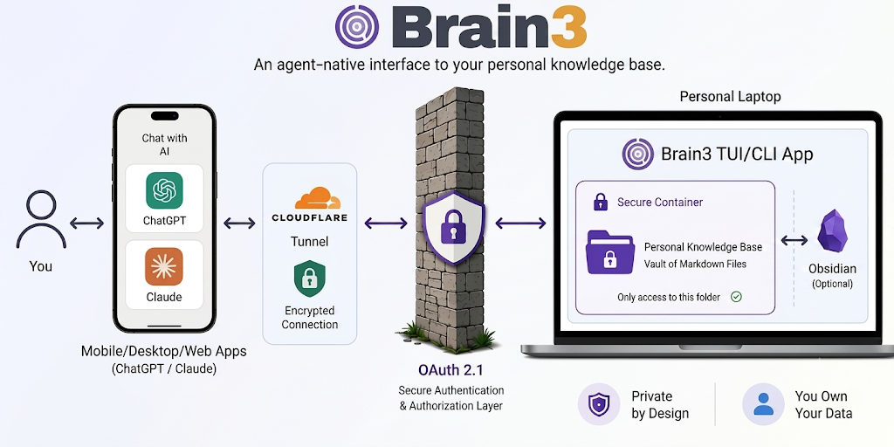
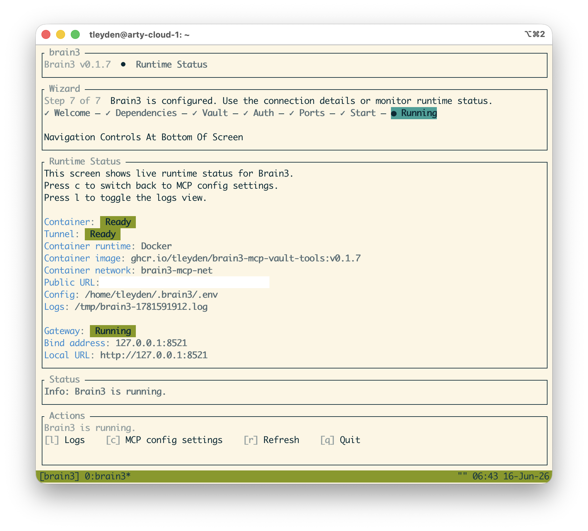
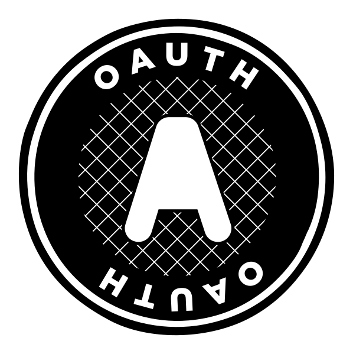
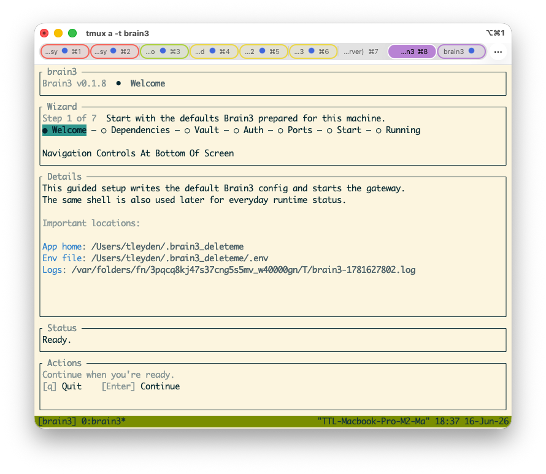
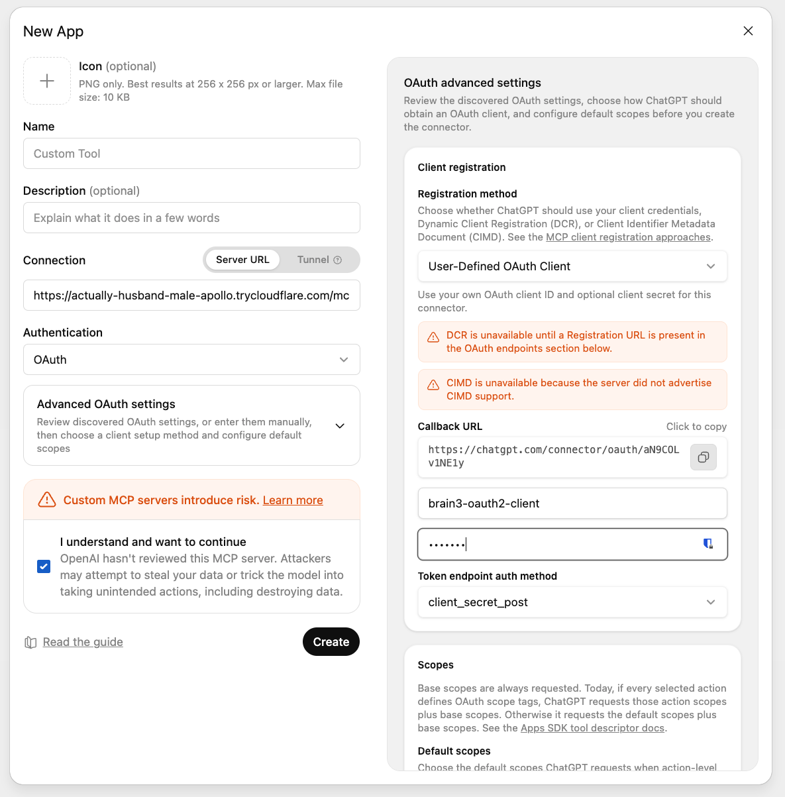
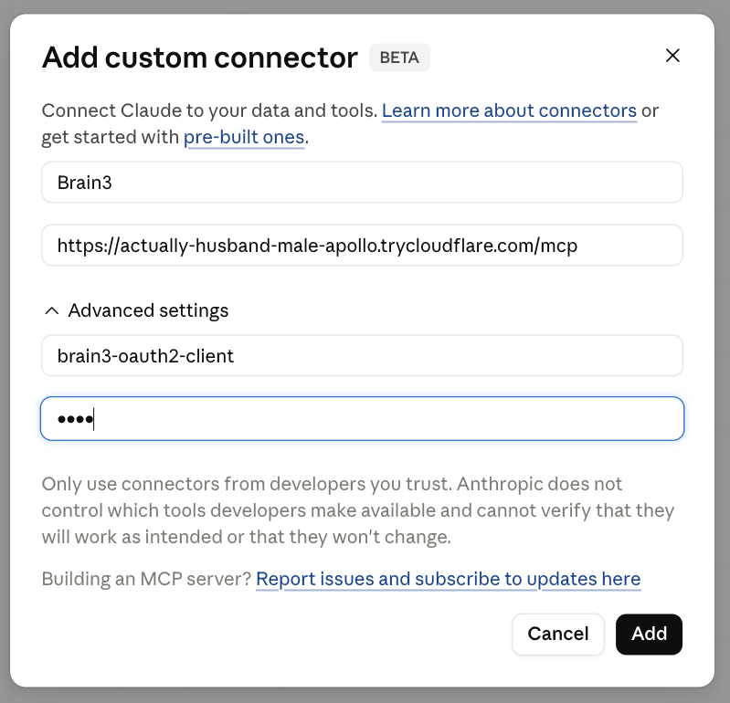

<p align="center">
  
  <br/>
  MCP server for your local markdown vault -- works with Claude, ChatGPT, or any MCP-compatible AI
  <br/>
  
</p>

Brain3 lets you interact with your local markdown vault through Claude, ChatGPT or any AI assistant that supports the Model Context Protocol (MCP) standard.

**Why This Exists**

I built this so I could access my Obsidian markdown vault directly from the Claude mobile app, in particular via voice dictation. 

Putting an AI assistant in front of your markdown vault brings it to a whole new level of convenience and user experience (UX). As you discover new ideas with your AI assistant, you can **quickly save those ideas to your markdown vault without switching contexts.** You can also easily pull in any context stored in your second brain directly into your current chat, creating a persistent fetch-develop-store loop for your ideas.  

Think of it like a **high-capacity memory system that you fully control** and can use with any AI assistant.  It's not quite [LLMWiki](https://gist.github.com/karpathy/442a6bf555914893e9891c11519de94f), but the plan is to take it that direction.  

Brain3 is designed to support open standards and is compatible with **any AI assistant that supports the MCP standard** for third-party connectors, such as:

*  Claude (🌐/🖥️/📱)
*  ChatGPT (🌐/🖥️/📱)
*  Jan.ai (🖥️) - supports local models such as Gemma4.  

Brain3 itself runs locally on your laptop, or on your cloud Virtual Private Server (VPS) if you have one. It runs as a remote MCP server that runs on your own machine (see [Privacy & Security](#privacy--security) for why), and you administer it from the command line via a Terminal UI (TUI).  

**Use Cases**

Use Brain3 to interact with your local notes through any AI assistant:

1. Save ideas to quickly [close any open loops](https://www.reddit.com/r/getdisciplined/comments/12vemas/advice_close_open_loops/)
2. Capture your research efforts when trying to understand a problem, or come up with a novel design
3. Comparing new ideas with existing notes
4. Quarterly, Weekly, and Daily Planning, such as Cal Newport's Multi-Scale Planning system ([youtube link](https://www.youtube.com/watch?v=3FipKTzkTD4))
5. Anything related to organizing, planning, decision-making and general knowledge management

<div align="center">

https://github.com/user-attachments/assets/9c58b146-a874-4faf-8e43-f6b7f7f48e75

<em>Sample Weekly Planning Session With ChatGPT and Brain3</em>

</div>

## Screenshots - Admin Terminal UI (TUI)

<a href="docs/screenshots/tui_screenshot.png">
  
</a>

## Features

- 🔐 Your markdown vault data stays 100% local and private (note: it's exposed to your AI assistant via a [Cloudflare Tunnel](#remote-mcp--cloudflare-tunnels))
- Uses  [Docker](https://www.docker.com) and  [Native macOS container technology](https://github.com/apple/container) to reduce the attack surface
- 🛡️ Includes an [AI security audit](docs/SECURITY_AUDIT_LATEST.md) that is updated regularly for new releases. 
- 🎙️ Compatible with native voice dictation features in Claude and ChatGPT.
-  Obsidian and LLMWiki compatible (but neither are required)
-  Runs in the command line as a Terminal UI (TUI), tested on macOS and Linux
- 🚯 **Not AI Slop** -- this project uses coding agents but maintains a high quality bar through regular manual review and testing.


## Requirements

* OS:  macOS,  Linux - MS Windows should also work, I'm looking for people to help test.
*  Cloudflare Tunnel - but no account needed, and it's a one-liner install.
* AI Assistant (e.g.  ChatGPT,  Claude, etc) 
* 🏠 If you want it to be accessible 24/7, you'll need a dedicated home computer or cloud server (VPS), similar to how OpenClaw works (got mac mini?).

## Privacy & Security

<details>
<summary>🔒 View Privacy & Security Details</summary>

- 🛡️ Includes an [AI security audit](docs/SECURITY_AUDIT_LATEST.md) available, which will be done regularly on releases.  The known potential security risks are documented in [docs/POTENTIAL_SECURITY_RISKS.md](docs/POTENTIAL_SECURITY_RISKS.md).
- 🔒 Data isolation - the AI sees only the parts of your vault exposed through your prompts; your vault is never uploaded to any Brain3-managed cloud service
-   Container-based filesystem isolation plus internal-only networking by default; no other host directories are mounted unless you enable dev mode
-  Secure Cloudflare tunnels with TLS; `cloudflared` creates outbound-only connections so Brain3 does not need a publicly routable IP
-  OAuth2.1 with PKCE to authenticate with the AI provider; only the client you configure can get tokens — no open registration (DCR/CIMD disabled)
- 🦀 Host process written in Rust to minimize attack surface and reduce several classes of vulnerabilities
-  The MCP server running in the container uses the battle-tested FastMCP server framework
- You retain full control and can stop Brain3, disable the tunnel, or disconnect your AI app whenever you choose

### Remote MCP & Cloudflare Tunnels

Brain3 is a **remote MCP server that runs on your own machine**. Your vault never leaves your hardware -- but the connection from your AI assistant to Brain3 is remote, because that's the only connection model Claude and ChatGPT currently support for third-party MCP connectors.  (at least AFAIK, file an issue if you know otherwise)

That somewhat annoying constraint drives most of the stack: the Cloudflare tunnel gives Brain3 a reachable endpoint, and OAuth2.1/PKCE is what Claude and ChatGPT require before they'll connect to any remote MCP server. 

- ⚠️ You should only use Brain3 if you trust Cloudflare: Cloudflare owns the root TLS certs and has the ability to decrypt traffic. See their [Cloudflare Transparency Report - H2 2025](https://www.cloudflare.com/transparency/).
- Tunnels are cleaned up automatically when Brain3 stops.

### Authentication & Authorization

- Client secret is required at token exchange (`client_secret_post`).
- Auth codes are single-use and expire after 5 minutes.

### Request Integrity

- Bearer-token validation on all `/mcp` routes.
- Host validation rejects unexpected hostnames (HTTP 421) when a public hostname is configured.
- Upstream shared secret injected by Brain3 so the MCP container rejects direct calls that bypass Brain3.
- Constant-time comparison for all secret and token checks.

</details>

## Quick Start

###  Install macOS Prerequisites

- Container runtime: `brew install container && brew services start container`
- Cloudflare Tunnel: `brew install cloudflared`

macOS container recommended, but you can also use [Docker Desktop for Mac](https://docs.docker.com/desktop/setup/install/mac-install/)

###  Linux Prerequisites

<details>
<summary>Ubuntu/Debian install commands</summary>

```bash
# Docker
sudo apt update
sudo apt install ca-certificates curl
sudo install -m 0755 -d /etc/apt/keyrings
sudo curl -fsSL https://download.docker.com/linux/ubuntu/gpg -o /etc/apt/keyrings/docker.asc
sudo chmod a+r /etc/apt/keyrings/docker.asc
sudo tee /etc/apt/sources.list.d/docker.sources <<'EOF'
Types: deb
URIs: https://download.docker.com/linux/ubuntu
Suites: $(. /etc/os-release && echo "${UBUNTU_CODENAME:-$VERSION_CODENAME}")
Components: stable
Architectures: $(dpkg --print-architecture)
Signed-By: /etc/apt/keyrings/docker.asc
EOF
sudo apt update
sudo apt install docker-ce docker-ce-cli containerd.io docker-buildx-plugin docker-compose-plugin

# cloudflared
sudo mkdir -p --mode=0755 /usr/share/keyrings
curl -fsSL https://pkg.cloudflare.com/cloudflare-main.gpg | sudo tee /usr/share/keyrings/cloudflare-main.gpg >/dev/null
echo 'deb [signed-by=/usr/share/keyrings/cloudflare-main.gpg] https://pkg.cloudflare.com/cloudflared any main' | sudo tee /etc/apt/sources.list.d/cloudflared.list
sudo apt-get update
sudo apt-get install cloudflared
```

</details>

### Quick Start Step 1: Install the latest release

```bash
curl -sSfL https://brain3.s3.amazonaws.com/releases/v0.1.8/install.sh | sh
```

This installs `brain3` from the `v0.1.8` release.

### Quick Start Step 2: Run the Brain3 TUI app

In your terminal, run: 

```bash
$ brain3
```

On first run, Brain3 launches an interactive setup wizard.

<a href="docs/screenshots/SetupWizardScreenshot.png">
  
</a>

Follow the on-screen instructions to complete the setup, it should hopefully be self-explanatory.  After the setup is complete, it will continue running and will be ready to use.

To keep it running in the background even if your current shell exits, you can run it in a tool like [tmux](https://github.com/tmux/tmux/wiki).

If you want a stable hostname on your own Cloudflare-managed domain (recommended) instead of the default quick tunnel, use the separate named tunnel flow in [Advanced Configuration](#named-cloudflare-tunnel-on-your-domain) after first-run setup.

### Quick Start Step 3: Connect your AI app

In the Brain3 TUI, press `c` to open **MCP Config Settings**.

Brain3 displays all the connection information you need:

- Server URL
- Client ID
- Client Secret
- Username
- Password

Follow the instructions below for your AI client.

<details>
<summary> <strong>ChatGPT</strong></summary>

<a href="docs/screenshots/ChatGPTConfig.png">
  
</a>

1. Open **Settings → Connectors → Create Connector**.
2. Select **Custom MCP Server**.
3. Copy the **Server URL**, **Client ID**, and **Client Secret** from Brain3's MCP Config Settings screen.
4. Complete the OAuth authorization flow when prompted.
5. When shown a login screen, enter the **Username** and **Password** displayed in Brain3's MCP Config Settings screen.

Once authorization succeeds, Brain3 will be available as a connector in ChatGPT.

</details>

<details>
<summary> <strong>Claude</strong></summary>

<a href="docs/screenshots/ClaudeConfig.png">
  
</a>

1. Open **Settings → Connectors → Add Custom Connector**.
2. Enter the **Server URL** shown in Brain3.
3. If prompted, enter the **Client ID** and **Client Secret** from the MCP Config Settings screen.
4. Complete the OAuth authorization flow.
5. When shown a login screen, enter the **Username** and **Password** displayed in Brain3's MCP Config Settings screen.

Once authorization succeeds, Brain3 will appear as a custom connector in Claude.

</details>

<details>
<summary> <strong>Other MCP-Compatible AI Apps</strong></summary>

Most MCP-compatible AI applications require the same information displayed in Brain3's MCP Config Settings screen:

- Server URL
- Client ID
- Client Secret

After connecting, complete the OAuth sign-in flow using the **Username** and **Password** shown on that screen.

Refer to your AI application's documentation for client-specific setup instructions.

</details>

Once connected, you can ask your AI to search, organize, summarize, and edit your notes directly through Brain3.

### Quick Start Step 4 (Final Step): Interact with Brain3 via your AI assistant

Example prompt:
`List all the files in my Brain3 vault.`

Expected result:
Brain3 should list the files in your vault.


## Advanced Configuration Options

<details>
<summary> Named Cloudflare Tunnel on your domain (recommended)</summary>

Recommended if you want a stable hostname like `brain3.yourdomain.com`. This requires a Cloudflare account and a custom domain you control.

Named tunnels are also known to be more reliable and less likely to suffer rate limits or connectivity restrictions than quick tunnels, since quick tunnels are available to anyone without a Cloudflare account and may be throttled accordingly. 

Brain3's normal first-run setup configures the app and defaults to a Cloudflare quick tunnel. Named tunnel provisioning is a separate guided flow:

1. Run `brain3` once and complete the normal interactive setup wizard.
2. Create a (free) Cloudflare account at [cloudflare.com](https://cloudflare.com)
3. Install `cloudflared` if it is not already available — see [install instructions](https://developers.cloudflare.com/cloudflare-one/connections/connect-networks/downloads/)
4. In `~/.brain3/.env`, set `B3_CF_TUNNEL_NAME` and `B3_CF_DOMAIN`. Set `B3_CF_TUNNEL_CONFIG_FILE` only if you want a non-default config path; otherwise Brain3 uses `.cloudflared/<tunnel-name>.yml`.
5. Run the named tunnel provisioning wizard:

```bash
brain3 --cf-setup
```

6. The wizard verifies `cloudflared`, handles login if needed, creates or reuses the named tunnel, writes the config file, and configures the DNS route.
7. Start Brain3 normally with `brain3`. It will start `cloudflared` automatically and log:

```
INFO tunnel started url=https://brain3.yourdomain.com
```

</details>

<details>
<summary>Tunneling alternative: Direct public origin</summary>

This is an alternative to a Cloudflare Tunnel if tunnels are not practical in your environment. It is less preferred because it involves exposing ports more directly, so only use it when a Cloudflare Tunnel is not a workable option.

If your machine already has a public IP or sits behind Cloudflare proxy, use Caddy or nginx to terminate TLS and reverse-proxy to `127.0.0.1:8421`. Set `B3_DIRECT_PUBLIC_ORIGIN_HOSTNAME` in your `.env` to the public hostname; Brain3 uses it for hostname validation.

Example minimal Caddyfile:

```
brain3.yourdomain.com {
    reverse_proxy 127.0.0.1:8421
}
```

</details>

## Configuration Reference

All configuration is via environment variables, loaded from a `.env` file.

<details>
<summary>Brain3 Environment Variables</summary>

| Variable | Default | Description |
|---|---|---|
| `B3_OAUTH2_GATEWAY_PORT` | `8421` | Port Brain3 listens on |
| `B3_OAUTH2_GATEWAY_CLIENT_ID` | `brain3-oauth2-client` | OAuth client ID accepted by Brain3 |
| `B3_OAUTH2_GATEWAY_CLIENT_SECRET` | *(required)* | OAuth client secret required at token exchange |
| `B3_OAUTH2_ACCESS_TOKEN_LIFETIME_SECS` | `3600` | Lifetime of issued access tokens in seconds |
| `B3_TOKEN_DB_PATH` | `~/.brain3/brain3.db` | Optional override for the SQLite database path used for issued one-hour access tokens |
| `B3_OAUTH2_GATEWAY_MCP_UPSTREAM_URL` | *(auto-derived from `B3_CONTAINER_HOST_PORT`)* | URL of the upstream MCP server (developers only) |
| `B3_OAUTH2_GATEWAY_UPSTREAM_SECRET_FILE` | `/tmp/brain3-mcp-upstream-secret` | Path to the shared secret file |
| `B3_OAUTH2_PKCE_REQUIRED` | `true` | Require PKCE for OAuth flow |
| `B3_USERNAME` | *(required)* | Login username for the Brain3 sign-in page |
| `B3_PASSWORD` | *(required)* | Login password for the Brain3 sign-in page |
| `B3_OAUTH2_GATEWAY_ENFORCE_HOSTNAME_CHECK` | `true` | Reject requests for unexpected hostnames |
| `B3_CF_QUICK_TUNNEL` | `false` | Set to `true` to have Brain3 start a quick Cloudflare Tunnel on startup |
| `B3_CF_TUNNEL_NAME` | *(empty)* | Named Cloudflare Tunnel name; set with `B3_CF_DOMAIN` and then run `brain3 --cf-setup` to provision it |
| `B3_CF_DOMAIN` | *(empty)* | Cloudflare zone domain (used with `B3_CF_TUNNEL_NAME`) |
| `B3_CF_TUNNEL_CONFIG_FILE` | `.cloudflared/<tunnel-name>.yml` | Optional path to the `cloudflared` config file written during named tunnel provisioning |
| `B3_DIRECT_PUBLIC_ORIGIN_HOSTNAME` | *(empty)* | Public hostname when using direct origin (Caddy/nginx) instead of Cloudflare Tunnel |
| `B3_CONTAINER_RUNTIME` | *(empty = skip)* | `macos-container` or `docker`; if set, Brain3 starts the container on startup |
| `B3_VAULT_PATH` | *(required if runtime set)* | Absolute path to your Obsidian vault or markdown folder |
| `B3_CONTAINER_IMAGE` | *(required if runtime set)* | Published container image to run, e.g. `ghcr.io/tleyden/brain3-mcp-vault-tools:vX.Y.Z`. New installs default to the Brain3 release-matched tag; `:latest` is still published but must be chosen explicitly. |
| `B3_CONTAINER_HOST_PORT` | `8420` | Host loopback port published to the container |
| `B3_CONTAINER_INTERNAL_NETWORK_ISOLATION` | `true` | Keep the managed MCP container on an internal-only network with no default outbound route. Set to `false` only as a compatibility fallback if Docker/macOS internal networking is broken on your VPS or runtime. |
| `B3_VAULT_MCP_LOG_LEVEL` | `INFO` | Log level forwarded to the MCP server running inside the container. Set to `TRACE` to log the full body of every request/response sent to and from the MCP server, for debugging. |

</details>


<details>
<summary>MD Vault MCP Tools</summary>

Once connected, your AI app has access to these vault tools:

| Tool | Description |
|---|---|
| `vault_read` | Read a file or line range. Returns a content hash for safe patching. |
| `vault_create_overwrite_file` | Create a new note or replace an existing one entirely. |
| `vault_apply_unified_diff` | Apply a unified diff to an existing file. Preferred for precise edits. |
| `vault_batch_frontmatter_update` | Update YAML frontmatter fields across one or more files. |
| `vault_search` | Full-text search across the vault. |
| `vault_search_frontmatter` | Search by frontmatter field values. |
| `vault_list` | List files and directories in the vault. |
| `vault_move` | Move or rename a file. |
| `vault_delete` | Delete a file. |

</details>

## Developers / Contributors

<details>
<summary><strong>Install Prerequisites</strong></summary>

Refer to the [Quick Start](#quick-start) prerequisites above.

</details>

<details>
<summary><strong>Clone and build from source</strong></summary>

```bash
git clone https://github.com/tleyden/brain3.git
cd brain3
cargo build --release
```

</details>

<details>
<summary><strong>Start Brain3</strong></summary>

```bash
./target/release/brain3
```

Brain3 launches the setup wizard on first run and goes straight to the runtime status screen on subsequent runs. See [Quick Start](#quick-start) for the full flow.

</details>

<details>
<summary><strong>Running tests</strong></summary>

```bash
cargo test
```

</details>

<details>
<summary><strong>Install a PR build</strong></summary>

PR install scripts are published at `https://brain3.s3.amazonaws.com/pr/<PR_NUMBER>/install.sh` while the PR is open.

```bash
curl -sSfL https://brain3.s3.amazonaws.com/pr/123/install.sh | sh
```

Replace `123` with the pull request number.

</details>

<details>
<summary>MCP container image selection</summary>

Fresh installs default to the release-matched MCP image `ghcr.io/tleyden/brain3-mcp-vault-tools:vX.Y.Z`, where `X.Y.Z` matches the Brain3 app version.

If you need a different published MCP image for a single launch or while creating a brand-new config, use `--container-tag`:

```bash
brain3 --container-tag latest
brain3 --container-tag pr-123
```

On an already configured install, `--container-tag` overrides the MCP container image for that launch only. During first-run setup, the selected tag becomes the image written into the new config.

The runtime status screen now reports whether the container is actually `Ready` or `Failed` after startup verification. If the container exits early, Brain3 shows the failure summary and log path instead of incorrectly reporting a successful start.

</details>

## Roadmap

* Improve search accuracy
* Add [LLMWiki](https://gist.github.com/karpathy/442a6bf555914893e9891c11519de94f) features to auto-summarize, organize, and improve search based on [Astro-Han/karpathy-llm-wiki](https://github.com/Astro-Han/karpathy-llm-wiki)
* NotebookLM features
* Desktop menu bar app with full system tray integration + GUI


## Credits 

* [obsidian-web-mcp](https://github.com/jimprosser/obsidian-web-mcp) was the inspiration and contributed code to the MCP server layer. Brain3's additions: human and AI security reviews, container-based filesystem isolation so the MCP process never has direct host access, and a Rust host process to reduce attack surface.  I contributed a few [issues](https://github.com/jimprosser/obsidian-web-mcp/issues/29) and [PRs](https://github.com/jimprosser/obsidian-web-mcp/pull/25) to the project.


## License 

Apache 2.0. See [LICENSE.MD](LICENSE.MD).
