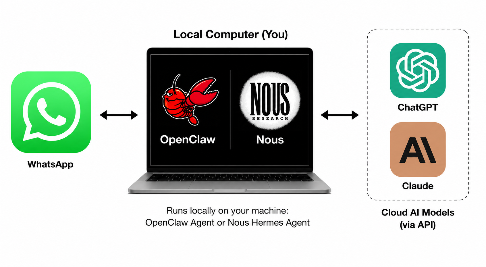
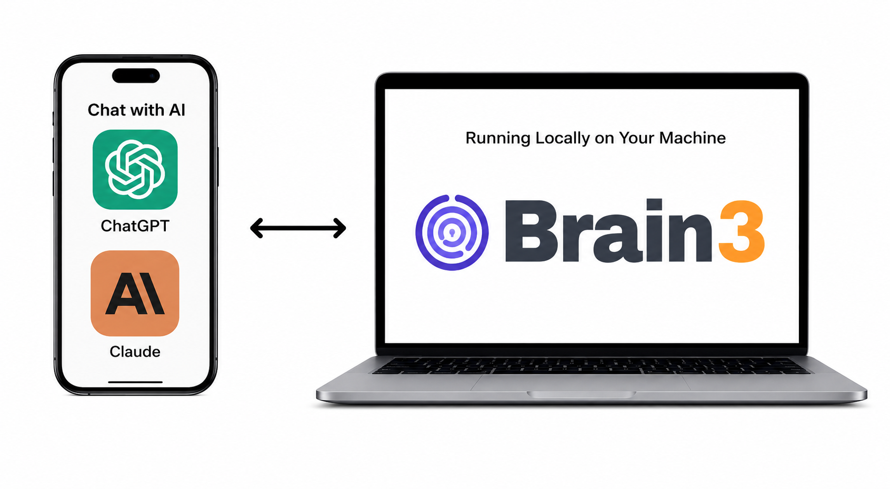

<p align="center">
  
  <br/>
  MCP server for your local markdown vault -- works with Claude, ChatGPT, or any MCP-compatible AI
  <br/>
  
</p>

Give your AI access to a local markdown vault. Save an idea mid-conversation and pull it back later, without switching apps or losing context. Use your AI's built-in voice dictation when you'd rather talk than type.

The notes stay as plain markdown on your machine, so you build up a memory that's yours and isn't locked to any one AI provider.

<div align="center">

https://github.com/user-attachments/assets/9c58b146-a874-4faf-8e43-f6b7f7f48e75

<em>Sample Weekly Planning Session With ChatGPT and Brain3</em>

</div>

<details>
<summary><strong>Use Cases</strong></summary>

1. Capture research and design thinking as you work through a problem
2. Compare new ideas against existing notes
3. Planning at any scale -- daily todos up to quarterly goals, such as Cal Newport's [Multi-Scale Planning system](https://www.youtube.com/watch?v=3FipKTzkTD4)
4. Save ideas to quickly [close any open loops](https://www.reddit.com/r/getdisciplined/comments/12vemas/advice_close_open_loops/)

</details>

## Screenshots - Admin Terminal UI (TUI)

<a href="docs/screenshots/tui_screenshot.png">
  
</a>


## Quick Start

### Install Prerequisites

####  macOS

- Container runtime: `brew install container && brew services start container`
- Cloudflare Tunnel: `brew install cloudflared`

macOS container is recommended, but you can also use [Docker Desktop for Mac](https://docs.docker.com/desktop/setup/install/mac-install/)

####  Linux

<details>
<summary>Ubuntu/Debian install commands</summary>

```bash
# Docker
sudo apt update
sudo apt install ca-certificates curl
sudo install -m 0755 -d /etc/apt/keyrings
sudo curl -fsSL https://download.docker.com/linux/ubuntu/gpg -o /etc/apt/keyrings/docker.asc
sudo chmod a+r /etc/apt/keyrings/docker.asc
sudo tee /etc/apt/sources.list.d/docker.sources <<'EOF'
Types: deb
URIs: https://download.docker.com/linux/ubuntu
Suites: $(. /etc/os-release && echo "${UBUNTU_CODENAME:-$VERSION_CODENAME}")
Components: stable
Architectures: $(dpkg --print-architecture)
Signed-By: /etc/apt/keyrings/docker.asc
EOF
sudo apt update
sudo apt install docker-ce docker-ce-cli containerd.io docker-buildx-plugin docker-compose-plugin

# cloudflared
sudo mkdir -p --mode=0755 /usr/share/keyrings
curl -fsSL https://pkg.cloudflare.com/cloudflare-main.gpg | sudo tee /usr/share/keyrings/cloudflare-main.gpg >/dev/null
echo 'deb [signed-by=/usr/share/keyrings/cloudflare-main.gpg] https://pkg.cloudflare.com/cloudflared any main' | sudo tee /etc/apt/sources.list.d/cloudflared.list
sudo apt-get update
sudo apt-get install cloudflared
```
</details>

### Install and run Brain3

```bash
curl -sSfL https://brain3.s3.amazonaws.com/releases/v0.1.8/install.sh | sh
```

Now run it:

```bash
brain3
```

It should launch an interactive setup wizard.

<a href="docs/screenshots/SetupWizardScreenshot.png">
  
</a>

### Configure your AI 

In the Brain3 TUI, press `c` to open **MCP Config Settings**.

Brain3 displays all the connection information you need.  Follow the instructions below for your AI client.

<details>
<summary> <strong>ChatGPT</strong></summary>

<a href="docs/screenshots/ChatGPTConfig.png">
  
</a>

1. Open **Settings → Connectors → Create Connector**.
2. Select **Custom MCP Server**.
3. Copy the **Server URL**, **Client ID**, and **Client Secret** from Brain3's MCP Config Settings screen.
4. Complete the OAuth authorization flow when prompted.
5. When shown a login screen, enter the **Username** and **Password** displayed in Brain3's MCP Config Settings screen.

Once authorization succeeds, Brain3 will be available as a connector in ChatGPT.

</details>

<details>
<summary> <strong>Claude</strong></summary>

<a href="docs/screenshots/ClaudeConfig.png">
  
</a>

1. Open **Settings → Connectors → Add Custom Connector**.
2. Enter the **Server URL** shown in Brain3.
3. If prompted, enter the **Client ID** and **Client Secret** from the MCP Config Settings screen.
4. Complete the OAuth authorization flow.
5. When shown a login screen, enter the **Username** and **Password** displayed in Brain3's MCP Config Settings screen.

Once authorization succeeds, Brain3 will appear as a custom connector in Claude.

</details>

Now you're ready to access your markdown vault through your AI.

## Security and Privacy 

⚠️ Brain3 exposes a local service over a Cloudflare tunnel, which carries real security tradeoffs. The OAuth 2.1 implementation is currently hand-rolled rather than built on a battle-tested library. See [Privacy & Security Details](#privacy--security) before running this on sensitive data. 

## Roadmap

* Improve search accuracy, right now it's pretty basic.
* Add [LLMWiki](https://gist.github.com/karpathy/442a6bf555914893e9891c11519de94f) features to auto-summarize, organize, and improve search based on [Astro-Han/karpathy-llm-wiki](https://github.com/Astro-Han/karpathy-llm-wiki)
* NotebookLM features
* Desktop menu bar app with full system tray integration + GUI

## Comparing overall design vs. OpenClaw & Hermes

While both [OpenClaw](https://github.com/openclaw/openclaw) and [Hermes Agent](https://github.com/nousresearch/hermes-agent) also make it easy to chat with your markdown vault, there is a fundamental difference in architecture and cost model.

**OpenClaw and Hermes Agent**



Routes your AI through a messaging app to reach local resources, often requiring direct API key use rather than subscription billing, which can get costly.

<details>
<summary>OpenClaw/Hermes Pros and Cons</summary>

| ✅ Pros | 🔴 Cons |
|------|------|
| Maximum flexibility | Anthropic does not allow subscription use with OpenClaw, and direct AI API key use can get extremely costly |
| Can access local resources | Inconsistent user interfaces, for example WhatsApp does not have native AI transcription and relies on OS |
| Vibrant plugin system | Most messaging apps don't support token streaming, so you need to wait for the full response |
| No direct internet access to laptop — only indirect access via chat apps like WhatsApp | If you start conversations in a native AI app, you have to then switch to your messaging app to chat with your agent |
| Local memories, with self-improving learning loops | |

</details>

**Brain3**



Connects your vault directly to your AI via MCP, works with your existing Claude or ChatGPT subscription, and you never leave your native AI app.

<details>
<summary>Brain3 Pros and Cons</summary>

| ✅ Pros | 🔴 Cons |
|------|------|
| Will *always work* with AI provider subscription-based billing | Requires publicly accessible network endpoint via Cloudflare tunnel |
| AI-native voice transcription (STT) and playback (TTS) | Potentially higher round-trip latency, especially with multiple tool calls |
| Will immediately work when real-time voice conversation is enabled for MCP | For certain tasks, an additional local agent might be required, increasing latency further |
| | More limited by the MCP interface, whereas OpenClaw and Hermes can basically do anything you imagine |
| No need to leave the app context you're already in | |
| Fully portable across any AI that supports MCP standard | |

</details>

## Advanced Configuration Options

To keep it running in the background even if your current shell exits, you can run it in a tool like [tmux](https://github.com/tmux/tmux/wiki).

<details>
<summary> Named Cloudflare Tunnel on your domain (recommended)</summary>

Recommended if you want a stable hostname like `brain3.yourdomain.com`. This requires a Cloudflare account and a custom domain you control.

Named tunnels are also known to be more reliable and less likely to suffer rate limits or connectivity restrictions than quick tunnels, since quick tunnels are available to anyone without a Cloudflare account and may be throttled accordingly. 

Brain3's normal first-run setup configures the app and defaults to a Cloudflare quick tunnel. Named tunnel provisioning is a separate guided flow:

1. Run `brain3` once and complete the normal interactive setup wizard.
2. Create a (free) Cloudflare account at [cloudflare.com](https://cloudflare.com)
3. Install `cloudflared` if it is not already available — see [install instructions](https://developers.cloudflare.com/cloudflare-one/connections/connect-networks/downloads/)
4. In `~/.brain3/.env`, set `B3_CF_TUNNEL_NAME` and `B3_CF_DOMAIN`. Set `B3_CF_TUNNEL_CONFIG_FILE` only if you want a non-default config path; otherwise Brain3 uses `.cloudflared/<tunnel-name>.yml`.
5. Run the named tunnel provisioning wizard:

```bash
brain3 --cf-setup
```

6. The wizard verifies `cloudflared`, handles login if needed, creates or reuses the named tunnel, writes the config file, and configures the DNS route.
7. Start Brain3 normally with `brain3`. It will start `cloudflared` automatically and log:

```
INFO tunnel started url=https://brain3.yourdomain.com
```

</details>

<details>
<summary>Tunneling alternative: Direct public origin</summary>

This is an alternative to a Cloudflare Tunnel if tunnels are not practical in your environment. It is less preferred because it involves exposing ports more directly, so only use it when a Cloudflare Tunnel is not a workable option.

If your machine already has a public IP or sits behind Cloudflare proxy, use Caddy or nginx to terminate TLS and reverse-proxy to `127.0.0.1:8421`. Set `B3_DIRECT_PUBLIC_ORIGIN_HOSTNAME` in your `.env` to the public hostname; Brain3 uses it for hostname validation.

Example minimal Caddyfile:

```
brain3.yourdomain.com {
    reverse_proxy 127.0.0.1:8421
}
```

</details>


## Privacy & Security

<details>
<summary>🔒 View Privacy & Security Details</summary>

### Remote MCP & Cloudflare Tunnels

Brain3 is a **remote MCP server that runs on your own machine**. 

Major AI apps like Claude and ChatGPT currently require remote MCP connectors to be publicly accessible on the internet via TLS + OAuth2.1/PKCE in order to be configured via their UI and accessible across all of their supported apps (web, mobile, desktop).

While there are ways to use purely local MCP, Brain3 is designed to be used as a remote MCP so that it can be easily accessible from AI.  This unfortunately makes the system quite complex and risky when trying to run it locally, but I don't know of any other way to do it.  Please file an issue if you know otherwise.    

That constraint drives most of the stack: the Cloudflare tunnel gives Brain3 a reachable TLS endpoint, and OAuth2.1/PKCE is used for auth, with a locally configured username and password.  

- ⚠️ You should only use Brain3 if you trust Cloudflare: Cloudflare owns the root TLS certs and has the ability to decrypt traffic. See their [Cloudflare Transparency Report - H2 2025](https://www.cloudflare.com/transparency/).
- Tunnels are cleaned up automatically when Brain3 stops.

### Security Audit and Known Security Risks

- Known potential security risks are listed in the [Known Security Risks](#known-security-risks) section below.
- There is a preliminary AI-based [security audit](SECURITY_AUDIT.md) available. If you are a security engineer and willing to volunteer some time, please reach out.

### Data Security

- Container isolation ensures that the **MCP server only sees the directory that you specify** in the config. The container bind-mount is the enforced path boundary — the MCP server cannot read files outside your vault directory, even if instructed to (e.g. a prompt asking it to read `../../../etc/passwd` will fail at the filesystem level).
- Your **vault is never uploaded** to any cloud service.

### Network layer security + Auth

- The container uses **internal-only networking by default** and cannot make outbound connections to the public internet.  
- Your machine doesn't need a "hole poked in the firewall" since it uses **outbound-only Cloudflare tunnel connections**.  However, that public Cloudflare endpoint does become an entry point to your system, and is fully dependent on the OAuth layer for security. 
- It uses OAuth2.1 with PKCE to authenticate with the AI provider; only the client you configure can get tokens, there is **no open registration** as both Dynamic Client Registration (DCR) and Client ID Meta Documents (CIMD) are disabled.
- Client secret is required at token exchange (`client_secret_post`).
- Auth codes are single-use and expire after 5 minutes.
- Every login issues a **fresh 256-bit access token** (1-hour lifetime by default), stored in a local SQLite database.
- **Refresh token rotation** — the refresh token is replaced on every use; the old token is immediately revoked.
- **Per-IP rate limiting** on credential endpoints: `POST /oauth/authorize` and `POST /oauth/token` are capped at 20 attempts per 15 minutes per IP. Cloudflare's `CF-Connecting-IP` header is used for accurate IP identification behind the tunnel.
- Bearer-token validation on all `/mcp` routes.  A shared key is bind-mounted into the MCP container so the MCP server can verify the token.
- **Host validation rejects unexpected hostnames** (HTTP 421) when a public hostname is configured. NOTE: this only works with Cloudflare tunnels associated with a DNS record, which is the recommended configuration.
- Constant-time comparison for secret and token value checks (secret *length* is not hidden — see [security audit](SECURITY_AUDIT.md) M-4).

### Miscellaneous

- 🦀 The host process is written in Rust which avoids several classes of vulnerabilities, like buffer overflow attacks.
-  The MCP server running in the container uses the well-known FastMCP server framework. 
- You retain full control and can stop Brain3, disable the tunnel, or disconnect your AI app whenever you choose
- The full source code for both the Brain3 gateway and the MCP server is available on GitHub in this repo.

</details>

### Known Security Risks

- **Prompt injection** — not mitigated by Brain3; the MCP server has no egress and runs in an isolated container network, but be careful what directory you point it at or what is in your vault.
- **Tampered release binaries** — release assets on S3/GitHub are not yet signed or checksummed, so a compromised distribution path could serve a modified binary.
- **Container port exposure (macOS)** — it is not yet confirmed whether the mapped container port is accessible only to the gateway or to any local process, which could allow OAuth bypass.
- **Weak generated passwords** — setup-generated passwords contain no symbols or uppercase letters.
- **No process sandboxing** — the Rust gateway has ambient filesystem and network access; a compromised dependency has no jail to contain it (unlike the MCP container). See `docs/SECURITY_AUDIT_LATEST.md` §6.3.
- **Hand-rolled OAuth 2.1** — Brain3 implements OAuth 2.1 itself rather than using a battle-tested library; Rust memory safety does not prevent protocol-level logic bugs. See `docs/SECURITY_AUDIT_LATEST.md` §6.4.
- **Plaintext secret storage** — all secrets (password, client secret, upstream shared secret) are stored in plaintext in `~/.brain3/.env` (file permissions are `0600`, but no encryption at rest).
- **No hostname validation in default (quick tunnel) mode** — hostname validation (HTTP 421 on unexpected `Host` headers) only works with named Cloudflare tunnels tied to a DNS record. The default quick tunnel setup currently disables it entirely. 


## Configuration Reference

All configuration is via environment variables, loaded from a `.env` file.

<details>
<summary>Brain3 Environment Variables</summary>

| Variable | Default | Description |
|---|---|---|
| `B3_OAUTH2_GATEWAY_PORT` | `8421` | Port Brain3 listens on |
| `B3_OAUTH2_GATEWAY_CLIENT_ID` | `brain3-oauth2-client` | OAuth client ID accepted by Brain3 |
| `B3_OAUTH2_GATEWAY_CLIENT_SECRET` | *(required)* | OAuth client secret required at token exchange |
| `B3_OAUTH2_ACCESS_TOKEN_LIFETIME_SECS` | `3600` | Lifetime of issued access tokens in seconds |
| `B3_TOKEN_DB_PATH` | `~/.brain3/brain3.db` | Optional override for the SQLite database path used for issued one-hour access tokens |
| `B3_OAUTH2_GATEWAY_MCP_UPSTREAM_URL` | *(auto-derived from `B3_CONTAINER_HOST_PORT`)* | URL of the upstream MCP server (developers only) |
| `B3_OAUTH2_GATEWAY_UPSTREAM_SECRET_FILE` | `/tmp/brain3-mcp-upstream-secret` | Path to the shared secret file |
| `B3_OAUTH2_PKCE_REQUIRED` | `true` | Require PKCE for OAuth flow |
| `B3_USERNAME` | *(required)* | Login username for the Brain3 sign-in page |
| `B3_PASSWORD` | *(required)* | Login password for the Brain3 sign-in page |
| `B3_OAUTH2_GATEWAY_ENFORCE_HOSTNAME_CHECK` | `true` | Reject requests for unexpected hostnames |
| `B3_CF_QUICK_TUNNEL` | `false` | Set to `true` to have Brain3 start a quick Cloudflare Tunnel on startup |
| `B3_CF_TUNNEL_NAME` | *(empty)* | Named Cloudflare Tunnel name; set with `B3_CF_DOMAIN` and then run `brain3 --cf-setup` to provision it |
| `B3_CF_DOMAIN` | *(empty)* | Cloudflare zone domain (used with `B3_CF_TUNNEL_NAME`) |
| `B3_CF_TUNNEL_CONFIG_FILE` | `.cloudflared/<tunnel-name>.yml` | Optional path to the `cloudflared` config file written during named tunnel provisioning |
| `B3_DIRECT_PUBLIC_ORIGIN_HOSTNAME` | *(empty)* | Public hostname when using direct origin (Caddy/nginx) instead of Cloudflare Tunnel |
| `B3_CONTAINER_RUNTIME` | *(empty = skip)* | `macos-container` or `docker`; if set, Brain3 starts the container on startup |
| `B3_VAULT_PATH` | *(required if runtime set)* | Absolute path to your Obsidian vault or markdown folder |
| `B3_CONTAINER_IMAGE` | *(required if runtime set)* | Published container image to run, e.g. `ghcr.io/tleyden/brain3-mcp-vault-tools:vX.Y.Z`. New installs default to the Brain3 release-matched tag; `:latest` is still published but must be chosen explicitly. |
| `B3_CONTAINER_HOST_PORT` | `8420` | Host loopback port published to the container |
| `B3_CONTAINER_INTERNAL_NETWORK_ISOLATION` | `true` | Keep the managed MCP container on an internal-only network with no default outbound route. Set to `false` only as a compatibility fallback if Docker/macOS internal networking is broken on your VPS or runtime. |
| `B3_VAULT_MCP_LOG_LEVEL` | `INFO` | Log level forwarded to the MCP server running inside the container. Set to `TRACE` to log the full body of every request/response sent to and from the MCP server, for debugging. |

</details>


<details>
<summary>MD Vault MCP Tools</summary>

Once connected, your AI app has access to these vault tools:

| Tool | Description |
|---|---|
| `vault_read` | Read a file or line range. Returns a content hash for safe patching. |
| `vault_create_overwrite_file` | Create a new note or replace an existing one entirely. |
| `vault_apply_unified_diff` | Apply a unified diff to an existing file. Preferred for precise edits. |
| `vault_batch_frontmatter_update` | Update YAML frontmatter fields across one or more files. |
| `vault_search` | Full-text search across the vault. |
| `vault_search_frontmatter` | Search by frontmatter field values. |
| `vault_list` | List files and directories in the vault. |
| `vault_move` | Move or rename a file. |
| `vault_delete` | Delete a file. |

</details>

## Developers / Contributors

See the [Quick Start](#quick-start) prerequisites above before continuing.

<details>
<summary><strong>Clone and build from source</strong></summary>

```bash
git clone https://github.com/tleyden/brain3.git
cd brain3
cargo build --release
```

</details>

<details>
<summary><strong>Start Brain3</strong></summary>

```bash
./target/release/brain3
```

Brain3 launches the setup wizard on first run and goes straight to the runtime status screen on subsequent runs. See [Quick Start](#quick-start) for the full flow.

</details>

<details>
<summary><strong>Running tests</strong></summary>

```bash
cargo test
```

</details>

<details>
<summary><strong>Install a PR build</strong></summary>

PR install scripts are published at `https://brain3.s3.amazonaws.com/pr/<PR_NUMBER>/install.sh` while the PR is open.

```bash
curl -sSfL https://brain3.s3.amazonaws.com/pr/123/install.sh | sh
```

Replace `123` with the pull request number.

</details>

<details>
<summary>MCP container image selection</summary>

Fresh installs default to the release-matched MCP image `ghcr.io/tleyden/brain3-mcp-vault-tools:vX.Y.Z`, where `X.Y.Z` matches the Brain3 app version.

If you need a different published MCP image for a single launch or while creating a brand-new config, use `--container-tag`:

```bash
brain3 --container-tag latest
brain3 --container-tag pr-123
```

On an already configured install, `--container-tag` overrides the MCP container image for that launch only. During first-run setup, the selected tag becomes the image written into the new config.

The runtime status screen now reports whether the container is actually `Ready` or `Failed` after startup verification. If the container exits early, Brain3 shows the failure summary and log path instead of incorrectly reporting a successful start.

</details>


## Credits 

* [obsidian-web-mcp](https://github.com/jimprosser/obsidian-web-mcp) was the inspiration and contributed code to the MCP server layer. Brain3 mainly adds container-based isolation.


## License 

Apache 2.0. See [LICENSE.MD](LICENSE.MD) and [NOTICE.MD](NOTICE.MD).
