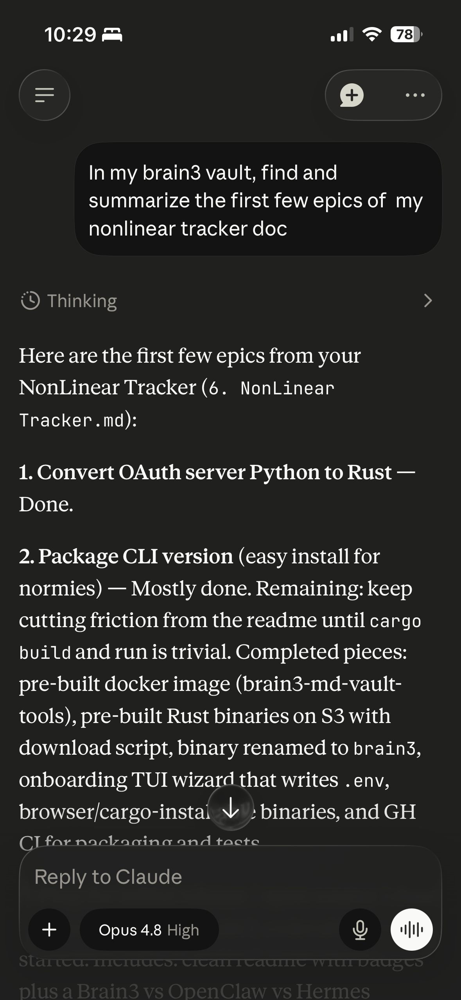
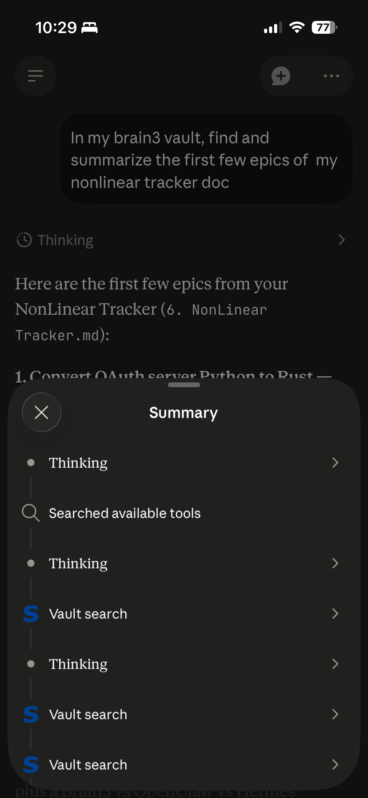

Brain3 let's you interact with your local markdown vault (aka "second brain") through Claude, ChatGPT or any AI assistant that supports the Model Context Protocol (MCP) standard.

**Why This Exists**

I built this so I could access my Obsidian markdown vault via the Claude Mobile app via text chat and voice dictation. 

The interface feels quite powerful and seamless. For example, as you discover new ideas with your AI assistant, you can **quickly save those ideas to your markdown vault without switching contexts.**

It is designed to support open standards and is compatible with **any AI assistant that supports the MCP standard** for 3rd-party connectors, such as:

*  Claude (🌐/🖥️/📱)
*  ChatGPT (🌐/🖥️/📱)
*  Jan.ai (🖥️) - supports local models such as Gemma4.  

Brain3 itself runs locally or on your cloud Virtual Private Server (VPS) in the command line as a Terminal UI (TUI) for now, but it will also be available as a standalone desktop menu bar app.  See the [roadmap](#roadmap) below for more details.

## Features

- 🔐 Your markdown vault data stays 100% local and private
- Uses  [Docker](https://www.docker.com) and  [Native MacOS container technology](https://github.com/apple/container) to reduce the attack surface
- 🛡️ Includes an [AI security audit](docs/security_audit_claude_sonnet_4_6.md) available, which will be done regularly on releases.
- 🎙️ Compatible with native voice dictation features in Claude and ChatGPT.
-  Obsidian-compatible (but Obsidian not required)
-  Runs in the command line as a Terminal UI (TUI), tested on MacOS and Linux
- 🚯 **Not AI Slop** - I'm using coding agents, but I'm following the [bettervibe best practices](https://bettervibe.org/guide/) (of which I'm a co-author) to ensure that the quality bar stays high.

## Screenshots (w/ Claude Mobile)

<table><tr>
<td></td>
<td></td>
</tr><tr>
<td colspan="2" align="center">Chatting w/ Brain3 MCP and showing tool calls</td>
</tr></table>

## Privacy and Security

- 🔒 Data isolation controls - the AI assistant only sees a part of your vault based on your prompts
-   Container-based filesystem and network isolation
-  Secure Cloudflare tunnels with TLS
-  OAuth2.1 with PKCE is used to authenticate with the AI provider
- 🦀 Host process written in Rust to avoid several classes of vulnerabilities
-  The MCP server running in the container uses the battle-tested FastMCP server framework
- More details below in [Privacy & Security Details](#privacy--security-details)

## Requirements

* OS:  MacOS,  Linux - MS Windows would work in theory, but I don't have a testing machine.
*  Cloudflare Tunnel - but no account needed, and it's a one-liner install.
* AI Assistant (e.g.  ChatGPT,  Claude, etc) 
* 🏠 If you want it to be accessible 24/7, you'll need a dedicated home computer or cloud server (VPS), similar to how OpenClaw works (got mac mini?).

## Quick Start

###  macOS Prerequisites

- Container runtime: `brew install container && brew services start container` ([you can also use Docker Desktop for Mac](https://docs.docker.com/desktop/setup/install/mac-install/))
- Cloudflare Tunnel: `brew install cloudflared`

###  Linux Prerequisites

<details>
<summary>Ubuntu/Debian install commands</summary>

```bash
# Docker
sudo apt update
sudo apt install ca-certificates curl
sudo install -m 0755 -d /etc/apt/keyrings
sudo curl -fsSL https://download.docker.com/linux/ubuntu/gpg -o /etc/apt/keyrings/docker.asc
sudo chmod a+r /etc/apt/keyrings/docker.asc
sudo tee /etc/apt/sources.list.d/docker.sources <<'EOF'
Types: deb
URIs: https://download.docker.com/linux/ubuntu
Suites: $(. /etc/os-release && echo "${UBUNTU_CODENAME:-$VERSION_CODENAME}")
Components: stable
Architectures: $(dpkg --print-architecture)
Signed-By: /etc/apt/keyrings/docker.asc
EOF
sudo apt update
sudo apt install docker-ce docker-ce-cli containerd.io docker-buildx-plugin docker-compose-plugin

# cloudflared
sudo mkdir -p --mode=0755 /usr/share/keyrings
curl -fsSL https://pkg.cloudflare.com/cloudflare-main.gpg | sudo tee /usr/share/keyrings/cloudflare-main.gpg >/dev/null
echo 'deb [signed-by=/usr/share/keyrings/cloudflare-main.gpg] https://pkg.cloudflare.com/cloudflared any main' | sudo tee /etc/apt/sources.list.d/cloudflared.list
sudo apt-get update
sudo apt-get install cloudflared
```

</details>

### 1. Install the latest release

```bash
curl -sSfL https://brain3.s3.amazonaws.com/releases/v0.1.6/install.sh | sh
```

This installs `brain3` from the `v0.1.6` release.

### 2. Start Brain3

```bash
brain3
```

On first run, Brain3 launches an interactive setup wizard that walks you through vault selection, credential creation, and dependency checks.

On subsequent runs, Brain3 goes straight to the runtime status screen.

If you want a stable hostname on your own Cloudflare-managed domain instead of the default quick tunnel, use the separate named tunnel flow in [Advanced Configuration](#named-cloudflare-tunnel-on-your-domain) after first-run setup.

### 3. Connect your AI app

In the Brain3 TUI, press `c` to open **MCP Config Settings**.

Brain3 displays all the connection information you need:

- Server URL
- Client ID
- Client Secret
- Username
- Password

Follow the instructions below for your AI client.

<details>
<summary> <strong>ChatGPT</strong></summary>

1. Open **Settings → Connectors → Create Connector**.
2. Select **Custom MCP Server**.
3. Copy the **Server URL**, **Client ID**, and **Client Secret** from Brain3's MCP Config Settings screen.
4. Complete the OAuth authorization flow when prompted.
5. When shown a login screen, enter the **Username** and **Password** displayed in Brain3's MCP Config Settings screen.

Once authorization succeeds, Brain3 will be available as a connector in ChatGPT.

</details>

<details>
<summary> <strong>Claude</strong></summary>

1. Open **Settings → Connectors → Add Custom Connector**.
2. Enter the **Server URL** shown in Brain3.
3. If prompted, enter the **Client ID** and **Client Secret** from the MCP Config Settings screen.
4. Complete the OAuth authorization flow.
5. When shown a login screen, enter the **Username** and **Password** displayed in Brain3's MCP Config Settings screen.

Once authorization succeeds, Brain3 will appear as a custom connector in Claude.

</details>

<details>
<summary> <strong>Other MCP-Compatible AI Apps</strong></summary>

Most MCP-compatible AI applications require the same information displayed in Brain3's MCP Config Settings screen:

- Server URL
- Client ID
- Client Secret

After connecting, complete the OAuth sign-in flow using the **Username** and **Password** shown on that screen.

Refer to your AI application's documentation for client-specific setup instructions.

</details>

Once connected, you can ask your AI to search, organize, summarize, and edit your notes directly through Brain3.

### 4. Interact with Brain3 via your AI assistant

Example prompt:
`List all the files in my Brain3 vault.`

Expected result:
Brain3 should list the files in your vault.

## Privacy & Security Details

See [docs/privacy_and_security_details.md](docs/privacy_and_security_details.md).

## Advanced Configuration

###  Named Cloudflare Tunnel on your domain

Recommended if you want a stable hostname like `brain3.yourdomain.com`. This requires a Cloudflare account and a custom domain you control.

Named tunnels are also known to be more reliable and less likely to suffer rate limits or connectivity restrictions than quick tunnels, since quick tunnels are available to anyone without a Cloudflare account and may be throttled accordingly. 

Brain3's normal first-run setup configures the app and defaults to a Cloudflare quick tunnel. Named tunnel provisioning is a separate guided flow:

1. Run `brain3` once and complete the normal interactive setup wizard.
2. Install `cloudflared` if it is not already available — see [install instructions](https://developers.cloudflare.com/cloudflare-one/connections/connect-networks/downloads/)
3. In `~/.brain3/.env`, set `B3_CF_TUNNEL_NAME` and `B3_CF_DOMAIN`. Set `B3_CF_TUNNEL_CONFIG_FILE` only if you want a non-default config path; otherwise Brain3 uses `.cloudflared/<tunnel-name>.yml`.
4. Run the named tunnel provisioning wizard:

```bash
brain3 --cf-setup
```

5. The wizard verifies `cloudflared`, handles login if needed, creates or reuses the named tunnel, writes the config file, and configures the DNS route.
6. Start Brain3 normally with `brain3`. It will start `cloudflared` automatically and log:

```
INFO tunnel started url=https://brain3.yourdomain.com
```

### Direct public origin

This is an alternative to a Cloudflare Tunnel if tunnels are not practical in your environment. It is less preferred because it involves exposing ports more directly, so only use it when a Cloudflare Tunnel is not a workable option.

If your machine already has a public IP or sits behind Cloudflare proxy, use Caddy or nginx to terminate TLS and reverse-proxy to `127.0.0.1:8421`. Set `B3_DIRECT_PUBLIC_ORIGIN_HOSTNAME` in your `.env` to the public hostname; Brain3 uses it for hostname validation.

Example minimal Caddyfile:

```
brain3.yourdomain.com {
    reverse_proxy 127.0.0.1:8421
}
```

## Configuration Reference

All configuration is via environment variables, loaded from a `.env` file.

### Brain3 App

| Variable | Default | Description |
|---|---|---|
| `B3_OAUTH2_GATEWAY_PORT` | `8421` | Port Brain3 listens on |
| `B3_OAUTH2_GATEWAY_CLIENT_ID` | `brain3-oauth2-client` | OAuth client ID accepted by Brain3 |
| `B3_OAUTH2_GATEWAY_CLIENT_SECRET` | *(required)* | OAuth client secret required at token exchange |
| `B3_OAUTH2_ACCESS_TOKEN_LIFETIME_SECS` | `3600` | Lifetime of issued access tokens in seconds |
| `B3_TOKEN_DB_PATH` | `~/.brain3/brain3.db` | Optional override for the SQLite database path used for issued one-hour access tokens |
| `B3_OAUTH2_GATEWAY_MCP_UPSTREAM_URL` | *(auto-derived from `B3_CONTAINER_HOST_PORT`)* | URL of the upstream MCP server (developers only) |
| `B3_OAUTH2_GATEWAY_UPSTREAM_SECRET_FILE` | `/tmp/brain3-mcp-upstream-secret` | Path to the shared secret file |
| `B3_OAUTH2_PKCE_REQUIRED` | `true` | Require PKCE for OAuth flow |
| `B3_USERNAME` | *(required)* | Login username for the Brain3 sign-in page |
| `B3_PASSWORD` | *(required)* | Login password for the Brain3 sign-in page |
| `B3_OAUTH2_GATEWAY_ENFORCE_HOSTNAME_CHECK` | `true` | Reject requests for unexpected hostnames |
| `B3_CF_QUICK_TUNNEL` | `false` | Set to `true` to have Brain3 start a quick Cloudflare Tunnel on startup |
| `B3_CF_TUNNEL_NAME` | *(empty)* | Named Cloudflare Tunnel name; set with `B3_CF_DOMAIN` and then run `brain3 --cf-setup` to provision it |
| `B3_CF_DOMAIN` | *(empty)* | Cloudflare zone domain (used with `B3_CF_TUNNEL_NAME`) |
| `B3_CF_TUNNEL_CONFIG_FILE` | `.cloudflared/<tunnel-name>.yml` | Optional path to the `cloudflared` config file written during named tunnel provisioning |
| `B3_DIRECT_PUBLIC_ORIGIN_HOSTNAME` | *(empty)* | Public hostname when using direct origin (Caddy/nginx) instead of Cloudflare Tunnel |
| `B3_CONTAINER_RUNTIME` | *(empty = skip)* | `macos-container` or `docker`; if set, Brain3 starts the container on startup |
| `B3_VAULT_PATH` | *(required if runtime set)* | Absolute path to your Obsidian vault or markdown folder |
| `B3_CONTAINER_IMAGE` | *(required if runtime set)* | Published container image to run, e.g. `ghcr.io/tleyden/brain3-mcp-vault-tools:vX.Y.Z`. New installs default to the Brain3 release-matched tag; `:latest` is still published but must be chosen explicitly. |
| `B3_CONTAINER_HOST_PORT` | `8420` | Host loopback port published to the container |

### MCP container image selection

Fresh installs default to the release-matched MCP image `ghcr.io/tleyden/brain3-mcp-vault-tools:vX.Y.Z`, where `X.Y.Z` matches the Brain3 app version. The registry still publishes `:latest`, but Brain3 does not select it automatically for new installs.

If an older Brain3 config still contains the exact official `ghcr.io/tleyden/brain3-mcp-vault-tools:latest` image, Brain3 now treats that as a legacy default and remaps it to the current release-matched tag for that run. Use `--container-tag latest` if you explicitly want to stay on `:latest`.

If you need a different published MCP image for a single launch or while creating a brand-new config, use `--container-tag`:

```bash
brain3 --container-tag latest
brain3 --container-tag pr-123
```

On an already configured install, `--container-tag` overrides the MCP container image for that launch only. During first-run setup, the selected tag becomes the image written into the new config.

The runtime status screen now reports whether the container is actually `Ready` or `Failed` after startup verification. If the container exits early, Brain3 shows the failure summary and log path instead of incorrectly reporting a successful start.

## MD Vault MCP Tools

Once connected, your AI app has access to these vault tools:

| Tool | Description |
|---|---|
| `vault_read` | Read a file or line range. Returns a content hash for safe patching. |
| `vault_create_overwrite_file` | Create a new note or replace an existing one entirely. |
| `vault_apply_unified_diff` | Apply a unified diff to an existing file. Preferred for precise edits. |
| `vault_batch_frontmatter_update` | Update YAML frontmatter fields across one or more files. |
| `vault_search` | Full-text search across the vault. |
| `vault_search_frontmatter` | Search by frontmatter field values. |
| `vault_list` | List files and directories in the vault. |
| `vault_move` | Move or rename a file. |
| `vault_delete` | Delete a file. |

## Developers / Contributors

### Running tests

```bash
cargo test
```

### Building

```bash
cargo build --release
```

## Build from Source (Developers)

### Prerequisites

Refer to the [Quick Start](#quick-start) prerequisites above.

### Install a PR build

PR install scripts are published at `https://brain3.s3.amazonaws.com/pr/<PR_NUMBER>/install.sh` while the PR is open.

```bash
curl -sSfL https://brain3.s3.amazonaws.com/pr/123/install.sh | sh
```

Replace `123` with the pull request number.

### Clone and build from source

```bash
git clone https://github.com/tleyden/brain3.git
cd brain3
cargo build --release
```

The binary is at `./target/release/brain3`.

### Start Brain3

```bash
./target/release/brain3
```

Brain3 launches the setup wizard on first run and goes straight to the runtime status screen on subsequent runs. See [Quick Start](#quick-start) fo r the full flow.

## Roadmap

* Create a documentation website
* Improve search accuracy
* Add [LLMWiki](https://gist.github.com/karpathy/442a6bf555914893e9891c11519de94f) features to auto-summarize, organize, and improve search
* NotebookLM features
* Desktop menu bar app with full system tray integration + GUI

## Credits 

* [obsidian-web-mcp](https://github.com/jimprosser/obsidian-web-mcp) provided an inspiring starting point, as well as actual code used in the MCP server itself as a starting point.


## License 

Apache 2.0. See [LICENSE.MD](LICENSE.MD).
