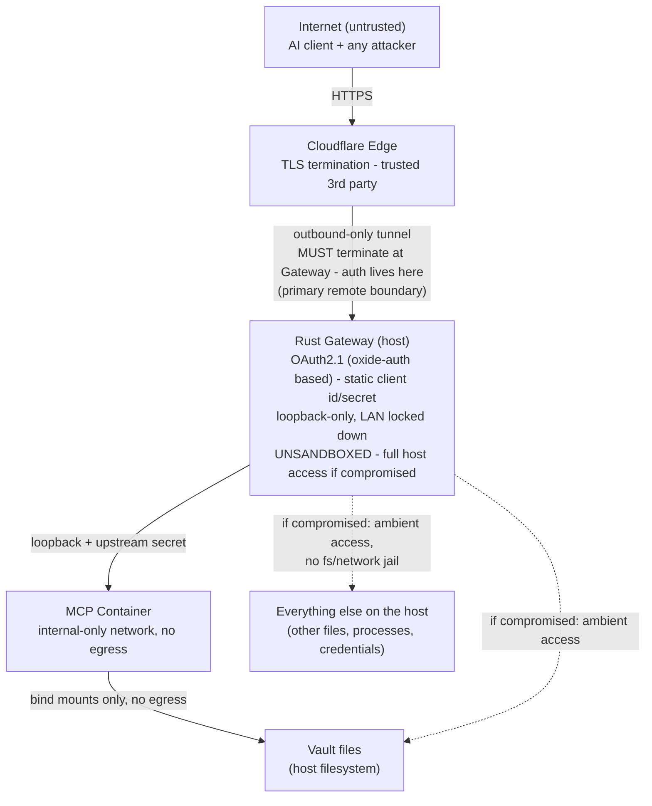

# Brain3 Security Audit

**Auditor:** Claude Sonnet 4.6  
**Date:** 2026-06-24  
**Scope:** Full codebase delta update for v0.2.1, incorporating the 2026-06-24 repository-wide security scan plus re-validation of carried-forward findings from the 2026-06-20 audit  
**Codebase version:** 0.2.1

_Default security report promoted from `docs/security/codex-security-scan-2026-06-24/report.md` on 2026-06-24._

> **See also:** [Known Security Risks](README.MD#known-security-risks) — tracked items deferred from this audit and items under investigation.

## Executive Summary

As of v0.2.1, Brain3 still has no HIGH-severity open findings. The most important open issues remain Brain3-owned OAuth policy and ingress weaknesses: host header trust in metadata/challenges (M-1), unrestricted runtime `redirect_uri` binding for the preregistered client (M-2), predictable `/tmp` placement for the upstream shared secret (M-8), secret-prefix logging in `upstream_secret.rs` (M-10), and the unsandboxed gateway process (M-12). The oxide-auth rebase meaningfully reduced Brain3's custom OAuth surface: the old Brain3-owned `constant_time_eq` wrapper (M-4) and in-memory auth-code store cleanup finding (L-1) are closed, and `GET /oauth/authorize` no longer merits a standalone rate-limit finding (L-4) because credential processing remains POST-only and the GET handler is tightly parameter-gated.

The 2026-06-24 repository scan added two important updates to the v0.2.1 picture. First, quick-tunnel public ingress is still effectively the default setup path, which sharpens the impact of host-validation gaps and is now folded into M-5. Second, trace logging can capture full MCP request and response bodies while gateway logs live in temp-backed files without an explicit permission clamp; that remains open as L-11. No new HIGH findings were introduced.

## Scope

Repository-wide security scan of the checked-out Brain3 git revision with prior audit context from `SECURITY_AUDIT.md` and the 2026-06-24 security-audit update plan. High-risk review focused on OAuth policy, public ingress via Cloudflare tunnels, container boundary exposure, local credential handling, and MCP logging.

- Scan mode: repository
- Target kind: git_revision
- Target ID: target_sha256_a9005ab7bfe057b4d7f87c5c0076da4e3c5bd7926c032f5bda02bf7f58a4620a
- Revision: 8d23b3c103f9da9a2d6acdce86c9ad0c8afbc93f
- Inventory strategy: repository
- Included paths: .
- Excluded paths: none
- Runtime or test status: Static source review only; no live exploit reproduction or network probe was executed during final validation.
- Artifacts reviewed: artifacts/01_context/threat_model.md, artifacts/02_discovery/deep_review_input.jsonl, artifacts/02_discovery/work_ledger.jsonl, artifacts/02_discovery/raw_candidates.jsonl, artifacts/03_coverage/repository_coverage_ledger.md, artifacts/03_coverage/reviewed_surfaces.md, artifacts/04_reconciliation/dedupe_report.md, artifacts/04_reconciliation/deduped_candidates.jsonl, artifacts/05_findings/
- Scan context: Brain3 is a local-first Obsidian-compatible vault gateway that intentionally serves a single preregistered confidential OAuth client and can optionally expose remote access through Cloudflare tunnels.

Limitations and exclusions:
- Prompt injection was treated as out of scope for user-controlled vault content, but remains a residual risk for vaults that ingest untrusted third-party material or shared remote content.
- Some local-only setup/TUI and helper files were closed with targeted review or explicit deferred follow-up rather than exhaustive line-by-line manual review; see `artifacts/02_discovery/work_ledger.jsonl`.
- No runtime tests, browser flows, or exploit demonstrations were run during this scan-only pass.
- Excluded `poc/**`: repository instructions mark `poc/` as dead legacy outside the active product unless explicitly requested.

### Scan Summary

| Field | Value |
| --- | --- |
| Reportable findings | 4 |
| Severity mix | medium: 3, low: 1 |
| Confidence mix | high: 3, medium: 1 |
| Coverage | partial |
| Validation mode | Repository-wide source review with per-candidate discovery, validation, and attack-path receipts plus reconciled file-level worklist closure. |

Canonical artifacts: `scan-manifest.json`, `findings.json`, and `coverage.json`. This report is a deterministic projection of those files.

## Threat Model

Brain3's highest-risk boundary is the optional public gateway/tunnel that fronts a local vault and containerized MCP server. The product intentionally restricts token issuance to one preregistered confidential client, but it still exposes OAuth metadata, login, token, and MCP proxy routes plus local secret files and container/runtime orchestration to different trust levels.

### Architecture & Trust Boundaries



### Assets

- Vault markdown contents and metadata exposed through MCP tools
- OAuth client credentials, user login password, access tokens, and refresh tokens
- The upstream shared secret mounted into the MCP container
- Local `.env`, Cloudflare tunnel config, and SQLite token database files
- Gateway public origin, Cloudflare tunnel identity, and container network isolation state

### Trust Boundaries

- Unauthenticated internet clients reaching the gateway directly or via Cloudflare tunnels
- The single preregistered confidential AI client that holds Brain3's client id and secret
- Local host filesystem and temp-directory principals
- The boundary between the Rust gateway and the `brain3-mcp-vault-tools` container
- Vault content that may be user-controlled or, in some deployments, third-party-controlled

### Attacker Capabilities

- Send arbitrary HTTP requests and headers to public gateway routes when tunneling is enabled
- Operate or compromise the preregistered OAuth client after it is provisioned with Brain3 credentials
- Read local files or logs available to the current OS principal or broader local principals
- Supply hostile vault content when the user does not fully control imported or shared notes

### Threat Actors

| Actor | Entry point | Goal | Contained? |
| --- | --- | --- | --- |
| Remote unauthenticated attacker | Public gateway routes via Cloudflare tunnel | Steal vault data, forge or steal OAuth tokens, enumerate the server | Mitigated by OAuth2.1 + PKCE + rate limiting, but not sandboxing |
| Compromised or malicious AI platform | Holds valid OAuth client credentials | Abuse legitimate MCP tool calls to exfiltrate or corrupt vault data | Bounded to what the MCP vault tools expose |
| Supply-chain attacker - container dependencies | Malicious Python package in the MCP container image | RCE inside the container | Yes - blocked at the container/host boundary by no-egress networking and bind-mounted vault-only filesystem exposure |
| Supply-chain attacker - Rust host dependencies | Malicious or compromised crate in the gateway dependency tree; `oxide-auth` and `oxide-auth-async` are now in the critical OAuth path | RCE in the unsandboxed gateway process -> read or exfiltrate any file the host user can access | No - full host access; see M-12 |
| Protocol-logic attacker against the Brain3-owned OAuth integration | Public gateway routes, malformed or adversarial OAuth requests | Exploit mistakes in Brain3-owned policy or request adaptation to trigger bad redirects, metadata confusion, or incorrect token issuance | Partially - oxide-auth now owns auth-code issuance and code-to-token exchange. Brain3 still owns `check_credentials`, `GatewayRegistrar`, `SqliteTokenStore`, metadata document construction, and token error normalization. See M-13 |
| Local or LAN actor | Loopback or container ports if binding assumptions fail, or local access to temp/log files | Bypass OAuth or recover sensitive local secrets and logs | Mitigated by hardcoded `127.0.0.1` binds for runtime services, but local plaintext secret and log surfaces remain |

### Security Objectives

- Only explicitly preregistered confidential clients should obtain tokens and reach protected MCP data
- Public ingress should be opt-in and should not broaden exposure accidentally
- Local secrets and vault contents should not leak through logs or insecure default storage/permissions
- Container networking should keep the MCP server private by default

### Assumptions

- `poc/` is dead legacy and out of active scan scope
- Rust memory safety is assumed; this scan focused on logic, policy, and boundary bugs rather than memory corruption
- Prompt injection is generally out of scope for user-controlled vault content, but not for vaults the user does not fully control

## Findings

| Finding | Severity | Confidence |
| --- | --- | --- |
| [OAuth metadata and bearer challenges trust request-supplied host headers](#finding-1) | medium | high |
| [OAuth authorization accepts arbitrary redirect URIs for the preregistered client](#finding-2) | medium | high |
| [Cloudflare quick tunnel is enabled by default on first run](#finding-3) | medium | high |
| [Trace logging can record MCP request and response bodies to temp-backed logs](#finding-4) | low | medium |

### Confidence Scale

| Label | Meaning |
| --- | --- |
| high | Direct evidence supports the finding with no material unresolved blocker. |
| medium | Evidence supports a plausible issue, but material runtime or reachability proof remains. |
| low | Evidence is incomplete and the item is retained only for explicit follow-up. |

<a id="finding-1"></a>

### [1] OAuth metadata and bearer challenges trust request-supplied host headers

| Field | Value |
| --- | --- |
| Severity | medium |
| Confidence | high |
| Confidence rationale | Both metadata builders and the unauthenticated 401 bearer-challenge path show the same request-derived base-URL behavior directly in source. |
| Category | Host header injection / OAuth metadata trust |
| CWE | CWE-346 |
| Affected lines | crates/platform/src/http/oauth_handlers.rs:289-299, crates/platform/src/http/oauth_handlers.rs:647-666, crates/platform/src/http/mcp_handlers.rs:17-27, crates/platform/src/http/mcp_handlers.rs:137-145 |

#### Summary

Brain3 derives its public `base_url` from `X-Forwarded-Host` and `Host` request headers, then reuses that value in OAuth metadata and bearer-challenge `resource_metadata` output.

#### Root Cause

The violated invariant is that OAuth metadata should advertise Brain3's configured public origin, not whichever host headers a request presents. Brain3 instead reconstructs its public identity from request headers and emits that value on unauthenticated metadata and challenge paths.

**OAuth metadata base URL comes from forwarded host headers** - `crates/platform/src/http/oauth_handlers.rs:289-299`

The public origin is constructed from request headers rather than a configured trusted hostname.

```rust
fn resolve_base_url(headers: &HeaderMap) -> String {
    let proto = headers
        .get("x-forwarded-proto")
        .and_then(|v| v.to_str().ok())
        .unwrap_or("http");
    let host = headers
        .get("x-forwarded-host")
        .or_else(|| headers.get("host"))
        .and_then(|v| v.to_str().ok())
        .unwrap_or("localhost");
    format!("{proto}://{host}")
```

**The derived base URL feeds OAuth metadata output** - `crates/platform/src/http/oauth_handlers.rs:647-666`

The request-derived base URL becomes the advertised issuer and OAuth endpoint set.

```rust
pub async fn oauth_metadata<P: McpProxyPort + 'static>(
    State(_state): State<AppState<P>>,
    headers: HeaderMap,
) -> impl IntoResponse {
    let base_url = resolve_base_url(&headers);
    tracing::info!(/* ... */);
    Json(json!({
        "issuer": base_url,
        "authorization_endpoint": format!("{base_url}/oauth/authorize"),
        "token_endpoint": format!("{base_url}/oauth/token"),
        /* ... */
    }))
```

**The MCP 401 path repeats the same base-URL derivation** - `crates/platform/src/http/mcp_handlers.rs:17-27`

The bearer-challenge path duplicates the same request-derived public origin logic.

```rust
fn resolve_base_url(headers: &HeaderMap) -> String {
    let proto = headers
        .get("x-forwarded-proto")
        .and_then(|v| v.to_str().ok())
        .unwrap_or("http");
    let host = headers
        .get("x-forwarded-host")
        .or_else(|| headers.get("host"))
        .and_then(|v| v.to_str().ok())
        .unwrap_or("localhost");
    format!("{proto}://{host}")
```

**Bearer challenge reflects the derived base URL into `resource_metadata`** - `crates/platform/src/http/mcp_handlers.rs:137-145`

Unauthenticated bearer challenges publish attacker-influenced metadata URLs before Brain3 authenticates the caller.

```rust
fn proxy_error_response(err: ProxyError, headers: &HeaderMap) -> Response {
    match err {
        ProxyError::Unauthorized(desc) => {
            let base_url = resolve_base_url(headers);
            let www_authenticate = format!(
                r#"Bearer error="invalid_token", error_description="{desc}", resource_metadata="{}""#,
                resource_metadata_url(&base_url)
            );
```

#### Validation

Validation followed both the OAuth metadata route and the MCP unauthorized-error path and found no configured-host binding before either output path emits public URLs.

Validation method: static source trace

**OAuth metadata base URL comes from forwarded host headers** - `crates/platform/src/http/oauth_handlers.rs:289-299`

The public origin is constructed from request headers rather than a configured trusted hostname.

```rust
fn resolve_base_url(headers: &HeaderMap) -> String {
    let proto = headers
        .get("x-forwarded-proto")
        .and_then(|v| v.to_str().ok())
        .unwrap_or("http");
    let host = headers
        .get("x-forwarded-host")
        .or_else(|| headers.get("host"))
        .and_then(|v| v.to_str().ok())
        .unwrap_or("localhost");
    format!("{proto}://{host}")
```

**The derived base URL feeds OAuth metadata output** - `crates/platform/src/http/oauth_handlers.rs:647-666`

The request-derived base URL becomes the advertised issuer and OAuth endpoint set.

```rust
pub async fn oauth_metadata<P: McpProxyPort + 'static>(
    State(_state): State<AppState<P>>,
    headers: HeaderMap,
) -> impl IntoResponse {
    let base_url = resolve_base_url(&headers);
    tracing::info!(/* ... */);
    Json(json!({
        "issuer": base_url,
        "authorization_endpoint": format!("{base_url}/oauth/authorize"),
        "token_endpoint": format!("{base_url}/oauth/token"),
        /* ... */
    }))
```

**The MCP 401 path repeats the same base-URL derivation** - `crates/platform/src/http/mcp_handlers.rs:17-27`

The bearer-challenge path duplicates the same request-derived public origin logic.

```rust
fn resolve_base_url(headers: &HeaderMap) -> String {
    let proto = headers
        .get("x-forwarded-proto")
        .and_then(|v| v.to_str().ok())
        .unwrap_or("http");
    let host = headers
        .get("x-forwarded-host")
        .or_else(|| headers.get("host"))
        .and_then(|v| v.to_str().ok())
        .unwrap_or("localhost");
    format!("{proto}://{host}")
```

**Bearer challenge reflects the derived base URL into `resource_metadata`** - `crates/platform/src/http/mcp_handlers.rs:137-145`

Unauthenticated bearer challenges publish attacker-influenced metadata URLs before Brain3 authenticates the caller.

```rust
fn proxy_error_response(err: ProxyError, headers: &HeaderMap) -> Response {
    match err {
        ProxyError::Unauthorized(desc) => {
            let base_url = resolve_base_url(headers);
            let www_authenticate = format!(
                r#"Bearer error="invalid_token", error_description="{desc}", resource_metadata="{}""#,
                resource_metadata_url(&base_url)
            );
```

#### Dataflow

Inbound `Host` / `X-Forwarded-Host` header -> `resolve_base_url()` -> OAuth metadata or bearer challenge output -> client trust decision

- **Source:** attacker-controlled request host headers
- **Sink:** publicly emitted OAuth metadata fields and `resource_metadata` challenge URLs
- **Outcome:** OAuth clients can be misdirected during metadata discovery or invalid-token recovery flows

**OAuth metadata base URL comes from forwarded host headers** - `crates/platform/src/http/oauth_handlers.rs:289-299`

The public origin is constructed from request headers rather than a configured trusted hostname.

```rust
fn resolve_base_url(headers: &HeaderMap) -> String {
    let proto = headers
        .get("x-forwarded-proto")
        .and_then(|v| v.to_str().ok())
        .unwrap_or("http");
    let host = headers
        .get("x-forwarded-host")
        .or_else(|| headers.get("host"))
        .and_then(|v| v.to_str().ok())
        .unwrap_or("localhost");
    format!("{proto}://{host}")
```

**The derived base URL feeds OAuth metadata output** - `crates/platform/src/http/oauth_handlers.rs:647-666`

The request-derived base URL becomes the advertised issuer and OAuth endpoint set.

```rust
pub async fn oauth_metadata<P: McpProxyPort + 'static>(
    State(_state): State<AppState<P>>,
    headers: HeaderMap,
) -> impl IntoResponse {
    let base_url = resolve_base_url(&headers);
    tracing::info!(/* ... */);
    Json(json!({
        "issuer": base_url,
        "authorization_endpoint": format!("{base_url}/oauth/authorize"),
        "token_endpoint": format!("{base_url}/oauth/token"),
        /* ... */
    }))
```

**Bearer challenge reflects the derived base URL into `resource_metadata`** - `crates/platform/src/http/mcp_handlers.rs:137-145`

Unauthenticated bearer challenges publish attacker-influenced metadata URLs before Brain3 authenticates the caller.

```rust
fn proxy_error_response(err: ProxyError, headers: &HeaderMap) -> Response {
    match err {
        ProxyError::Unauthorized(desc) => {
            let base_url = resolve_base_url(headers);
            let www_authenticate = format!(
                r#"Bearer error="invalid_token", error_description="{desc}", resource_metadata="{}""#,
                resource_metadata_url(&base_url)
            );
```

#### Reachability

The issue is reachable before authentication on real gateway routes. It does not require the attacker to compromise a confidential client first.

- **Attacker:** unauthenticated internet client on a public Brain3 deployment
- **Entry point:** `/oauth/metadata` and unauthorized `/mcp` responses
- **Outcome:** clients that trust Brain3's emitted metadata can be pointed at attacker-chosen origins or follow-up metadata URLs

#### Severity

**Medium** - The bug sits on a real OAuth trust boundary and is reachable before authentication, but it misdirects metadata consumers rather than directly minting tokens or bypassing authorization.

Severity would rise if public clients automatically follow Brain3 metadata without an operator trust check, and would fall if Brain3 binds metadata output to a configured public origin instead of request headers.

#### Remediation

Bind metadata and bearer-challenge output to a configured public origin or trusted proxy configuration instead of request-supplied host headers.

Tests:
- Add a metadata test that ignores attacker-supplied `Host`/`X-Forwarded-Host` values and emits the configured public origin.
- Add a 401 challenge test that `resource_metadata` matches the configured public origin even when request host headers differ.

Preventive controls:
- Centralize public-origin resolution behind a trusted configuration source.
- Keep host-header validation and metadata emission on the same invariant path.

<a id="finding-2"></a>

### [2] OAuth authorization accepts arbitrary redirect URIs for the preregistered client

| Field | Value |
| --- | --- |
| Severity | medium |
| Confidence | high |
| Confidence rationale | The authorize path and registrar binding logic both show the missing redirect allowlist directly, and the surviving attack path does not depend on speculative code paths. |
| Category | Open redirect / OAuth redirect URI trust |
| CWE | CWE-601 |
| Affected lines | crates/platform/src/http/oauth_handlers.rs:347-374, crates/platform/src/http/registrar.rs:32-45 |

#### Summary

Brain3 checks that the caller uses the fixed `client_id`, but it only requires a non-empty `redirect_uri` and then binds the caller-supplied URI directly into the authorization flow.

#### Root Cause

The violated invariant is that a confidential client's redirect endpoint must still be constrained to Brain3-approved callback URLs. Brain3 instead treats any non-empty runtime `redirect_uri` as authoritative once the caller uses the fixed `client_id`.

**Authorize validation only rejects an empty redirect URI** - `crates/platform/src/http/oauth_handlers.rs:347-374`

Brain3 validates `response_type`, the fixed `client_id`, and non-emptiness, but it does not constrain the callback origin or path.

```rust
fn validate_authorize_params(
    params: &LoginFormParams,
    config: &brain3_core::domain::model::GatewayConfig,
) -> Result<(), Response> {
    if params.response_type != "code" { /* ... */ }

    if params.client_id.is_empty() || params.client_id != config.oauth.client_id { /* ... */ }

    if params.redirect_uri.is_empty() {
        return Err((
            StatusCode::BAD_REQUEST,
            Json(json!({"error": "invalid_request", "error_description": "redirect_uri required"})),
        )
            .into_response());
    }
```

**Registrar preserves the submitted redirect URI unchanged** - `crates/platform/src/http/registrar.rs:32-45`

Once the client id matches, Brain3 binds whichever redirect URI the caller supplied instead of comparing it against an approved set.

```rust
fn bound_redirect<'a>(&self, bound: ClientUrl<'a>) -> Result<BoundClient<'a>, RegistrarError> {
    if bound.client_id.as_ref() != self.client_id {
        /* ... */
        return Err(RegistrarError::Unspecified);
    }
    let redirect_uri = bound.redirect_uri.ok_or(RegistrarError::Unspecified)?;
    Ok(BoundClient {
        client_id: bound.client_id,
        redirect_uri: Cow::Owned(redirect_uri.into_owned().into()),
    })
```

#### Validation

Validation traced the authorization request from parameter checks into the registrar binding step and found no allowlist, hostname restriction, or exact callback matching in Brain3-owned code.

Validation method: static source trace

**Authorize validation only rejects an empty redirect URI** - `crates/platform/src/http/oauth_handlers.rs:347-374`

Brain3 validates `response_type`, the fixed `client_id`, and non-emptiness, but it does not constrain the callback origin or path.

```rust
fn validate_authorize_params(
    params: &LoginFormParams,
    config: &brain3_core::domain::model::GatewayConfig,
) -> Result<(), Response> {
    if params.response_type != "code" { /* ... */ }

    if params.client_id.is_empty() || params.client_id != config.oauth.client_id { /* ... */ }

    if params.redirect_uri.is_empty() {
        return Err((
            StatusCode::BAD_REQUEST,
            Json(json!({"error": "invalid_request", "error_description": "redirect_uri required"})),
        )
            .into_response());
    }
```

**Registrar preserves the submitted redirect URI unchanged** - `crates/platform/src/http/registrar.rs:32-45`

Once the client id matches, Brain3 binds whichever redirect URI the caller supplied instead of comparing it against an approved set.

```rust
fn bound_redirect<'a>(&self, bound: ClientUrl<'a>) -> Result<BoundClient<'a>, RegistrarError> {
    if bound.client_id.as_ref() != self.client_id {
        /* ... */
        return Err(RegistrarError::Unspecified);
    }
    let redirect_uri = bound.redirect_uri.ok_or(RegistrarError::Unspecified)?;
    Ok(BoundClient {
        client_id: bound.client_id,
        redirect_uri: Cow::Owned(redirect_uri.into_owned().into()),
    })
```

#### Dataflow

Authorization request parameters -> `validate_authorize_params()` -> `GatewayRegistrar::bound_redirect()` -> authorization grant redirect URI -> code delivery to callback

- **Source:** caller-controlled `redirect_uri` in the authorize request
- **Sink:** bound authorization redirect URI
- **Outcome:** authorization codes are delivered to attacker-chosen callback endpoints for the configured client

**Authorize validation only rejects an empty redirect URI** - `crates/platform/src/http/oauth_handlers.rs:347-374`

Brain3 validates `response_type`, the fixed `client_id`, and non-emptiness, but it does not constrain the callback origin or path.

```rust
fn validate_authorize_params(
    params: &LoginFormParams,
    config: &brain3_core::domain::model::GatewayConfig,
) -> Result<(), Response> {
    if params.response_type != "code" { /* ... */ }

    if params.client_id.is_empty() || params.client_id != config.oauth.client_id { /* ... */ }

    if params.redirect_uri.is_empty() {
        return Err((
            StatusCode::BAD_REQUEST,
            Json(json!({"error": "invalid_request", "error_description": "redirect_uri required"})),
        )
            .into_response());
    }
```

**Registrar preserves the submitted redirect URI unchanged** - `crates/platform/src/http/registrar.rs:32-45`

Once the client id matches, Brain3 binds whichever redirect URI the caller supplied instead of comparing it against an approved set.

```rust
fn bound_redirect<'a>(&self, bound: ClientUrl<'a>) -> Result<BoundClient<'a>, RegistrarError> {
    if bound.client_id.as_ref() != self.client_id {
        /* ... */
        return Err(RegistrarError::Unspecified);
    }
    let redirect_uri = bound.redirect_uri.ok_or(RegistrarError::Unspecified)?;
    Ok(BoundClient {
        client_id: bound.client_id,
        redirect_uri: Cow::Owned(redirect_uri.into_owned().into()),
    })
```

#### Reachability

The attacker must control or compromise the single preregistered confidential client. Within that trust boundary, Brain3 hands the attacker the callback sink instead of enforcing an allowlist.

- **Attacker:** malicious or compromised preregistered confidential client
- **Entry point:** `/oauth/authorize` request for the fixed client id
- **Outcome:** Brain3 delivers the code to the attacker-controlled callback, and the same client can then redeem it with the configured secret

#### Severity

**Medium** - Exploitation requires control of the preregistered confidential client or its secret, but within that threat model the bug lets Brain3 deliver authorization codes to attacker-chosen callback endpoints.

Severity would rise if Brain3 adds more client identities or broader token privileges without tightening redirect binding, and would fall if redirect URIs are pinned to an explicit allowlist.

#### Remediation

Bind the preregistered client to an explicit allowlist of approved redirect URIs or approved callback origins instead of trusting runtime-supplied redirect values.

Tests:
- Add an authorize-flow test that rejects an unapproved `redirect_uri` even when `client_id` matches.
- Add a token-flow regression test that only previously approved redirect URIs can be bound and redeemed.

Preventive controls:
- Keep redirect binding policy in Brain3-owned configuration rather than in client-supplied request parameters.
- Re-review redirect policy before introducing any multi-client or broader-scope OAuth modes.

<a id="finding-3"></a>

### [3] Cloudflare quick tunnel is enabled by default on first run

| Field | Value |
| --- | --- |
| Severity | medium |
| Confidence | high |
| Confidence rationale | The default is directly visible in first-run setup, env parsing, and the checked-in template, with no material ambiguity about the resulting posture. |
| Category | Insecure default configuration |
| CWE | CWE-1188 |
| Affected lines | crates/core/src/application/first_run_setup.rs:30-40, crates/platform/src/config/env_file.rs:428-437, .env.template:47-50 |

#### Summary

Brain3's first-run setup and environment fallback both default to `CloudflareQuick`, so a new installation can become internet-reachable without an explicit remote-access opt-in.

#### Root Cause

The violated invariant is that remote ingress should require an explicit opt-in because Brain3 treats public tunneling as its highest-risk boundary. The default setup and env parsing paths instead select the public quick tunnel automatically.

**First-run setup seeds Cloudflare quick tunnel mode** - `crates/core/src/application/first_run_setup.rs:30-40`

A fresh setup draft is initialized with `CloudflareQuick` before the operator explicitly chooses a local-only mode.

```rust
let draft = SetupDraftConfig {
    gateway_port: DEFAULT_GATEWAY_PORT,
    client_id: DEFAULT_CLIENT_ID.to_string(),
    client_secret: self
        .port
        .generate_secret_hex(DEFAULT_GENERATED_SECRET_BYTES)?,
    access_token_lifetime_secs: DEFAULT_ACCESS_TOKEN_LIFETIME_SECS,
    refresh_token_lifetime_secs: DEFAULT_REFRESH_TOKEN_LIFETIME_SECS,
    username: DEFAULT_USERNAME.to_string(),
    password: String::new(),
    tunnel_mode: TunnelModeDraft::CloudflareQuick,
```

**Env-file parsing defaults `B3_CF_QUICK_TUNNEL` to true** - `crates/platform/src/config/env_file.rs:428-437`

When the operator leaves the quick-tunnel flag unset, Brain3 still resolves to a public quick tunnel instead of local-only mode.

```rust
// Default: quick tunnel unless explicitly disabled.
let quick_default = env_bool("B3_CF_QUICK_TUNNEL", true);
if quick_default {
    tracing::info!("B3_CF_QUICK_TUNNEL defaulting to true — using Cloudflare quick tunnel");
    return Ok(Some(TunnelConfig::CloudflareQuick {
        local_port: gateway_port,
    }));
}

tracing::info!("B3_CF_QUICK_TUNNEL=false and no named tunnel vars set — no tunnel configured");
```

#### Validation

The source trace followed setup draft generation into env-file parsing and the shipped template, showing a consistent default to `CloudflareQuick` when tunneling is not explicitly disabled.

Validation method: static source trace

**First-run setup seeds Cloudflare quick tunnel mode** - `crates/core/src/application/first_run_setup.rs:30-40`

A fresh setup draft is initialized with `CloudflareQuick` before the operator explicitly chooses a local-only mode.

```rust
let draft = SetupDraftConfig {
    gateway_port: DEFAULT_GATEWAY_PORT,
    client_id: DEFAULT_CLIENT_ID.to_string(),
    client_secret: self
        .port
        .generate_secret_hex(DEFAULT_GENERATED_SECRET_BYTES)?,
    access_token_lifetime_secs: DEFAULT_ACCESS_TOKEN_LIFETIME_SECS,
    refresh_token_lifetime_secs: DEFAULT_REFRESH_TOKEN_LIFETIME_SECS,
    username: DEFAULT_USERNAME.to_string(),
    password: String::new(),
    tunnel_mode: TunnelModeDraft::CloudflareQuick,
```

**Env-file parsing defaults `B3_CF_QUICK_TUNNEL` to true** - `crates/platform/src/config/env_file.rs:428-437`

When the operator leaves the quick-tunnel flag unset, Brain3 still resolves to a public quick tunnel instead of local-only mode.

```rust
// Default: quick tunnel unless explicitly disabled.
let quick_default = env_bool("B3_CF_QUICK_TUNNEL", true);
if quick_default {
    tracing::info!("B3_CF_QUICK_TUNNEL defaulting to true — using Cloudflare quick tunnel");
    return Ok(Some(TunnelConfig::CloudflareQuick {
        local_port: gateway_port,
    }));
}

tracing::info!("B3_CF_QUICK_TUNNEL=false and no named tunnel vars set — no tunnel configured");
```

**The shipped env template documents quick tunnel as the default** - `.env.template:47-50`

The template reinforces that operators start from an internet-reachable tunnel unless they override it.

```dotenv
# Option A: Quick tunnel — no DNS or config needed, URL changes on each restart.
# Default: true. The gateway will start cloudflared automatically on startup.
# Set to false (and leave B3_CF_TUNNEL_NAME/B3_CF_DOMAIN empty) to disable all tunneling.
B3_CF_QUICK_TUNNEL=true
```

#### Dataflow

First-run draft or unset env flag -> `TunnelModeDraft::CloudflareQuick` / `TunnelConfig::CloudflareQuick` -> cloudflared startup -> public gateway ingress

- **Source:** first-run defaults and unset tunnel configuration
- **Sink:** public Cloudflare tunnel startup
- **Outcome:** gateway OAuth, metadata, login, and health routes become internet-reachable without an explicit remote-access opt-in

**First-run setup seeds Cloudflare quick tunnel mode** - `crates/core/src/application/first_run_setup.rs:30-40`

A fresh setup draft is initialized with `CloudflareQuick` before the operator explicitly chooses a local-only mode.

```rust
let draft = SetupDraftConfig {
    gateway_port: DEFAULT_GATEWAY_PORT,
    client_id: DEFAULT_CLIENT_ID.to_string(),
    client_secret: self
        .port
        .generate_secret_hex(DEFAULT_GENERATED_SECRET_BYTES)?,
    access_token_lifetime_secs: DEFAULT_ACCESS_TOKEN_LIFETIME_SECS,
    refresh_token_lifetime_secs: DEFAULT_REFRESH_TOKEN_LIFETIME_SECS,
    username: DEFAULT_USERNAME.to_string(),
    password: String::new(),
    tunnel_mode: TunnelModeDraft::CloudflareQuick,
```

**Env-file parsing defaults `B3_CF_QUICK_TUNNEL` to true** - `crates/platform/src/config/env_file.rs:428-437`

When the operator leaves the quick-tunnel flag unset, Brain3 still resolves to a public quick tunnel instead of local-only mode.

```rust
// Default: quick tunnel unless explicitly disabled.
let quick_default = env_bool("B3_CF_QUICK_TUNNEL", true);
if quick_default {
    tracing::info!("B3_CF_QUICK_TUNNEL defaulting to true — using Cloudflare quick tunnel");
    return Ok(Some(TunnelConfig::CloudflareQuick {
        local_port: gateway_port,
    }));
}

tracing::info!("B3_CF_QUICK_TUNNEL=false and no named tunnel vars set — no tunnel configured");
```

**The shipped env template documents quick tunnel as the default** - `.env.template:47-50`

The template reinforces that operators start from an internet-reachable tunnel unless they override it.

```dotenv
# Option A: Quick tunnel — no DNS or config needed, URL changes on each restart.
# Default: true. The gateway will start cloudflared automatically on startup.
# Set to false (and leave B3_CF_TUNNEL_NAME/B3_CF_DOMAIN empty) to disable all tunneling.
B3_CF_QUICK_TUNNEL=true
```

#### Reachability

No attacker interaction is needed to widen exposure. The risk materializes when an operator accepts defaults on a new deployment or leaves the tunnel flag unset.

- **Attacker:** internet-origin attacker after default public deployment
- **Entry point:** public gateway routes made reachable by the quick tunnel
- **Outcome:** any present or future gateway logic bug sits on a broader remote attack surface than a local-only operator may expect

#### Severity

**Medium** - This default materially broadens attacker reachability at the project's primary threat boundary, but it does not by itself bypass Brain3's OAuth or hostname controls.

Severity would rise if unauthenticated or weakly authenticated gateway routes remain exposed remotely, and would fall if Brain3 switches to a local-only default with an explicit remote-access confirmation step.

#### Remediation

Make local-only operation the default and require an explicit operator action before Brain3 starts any Cloudflare tunnel.

Tests:
- Add an integration test that a fresh setup draft resolves to no tunnel until the operator explicitly selects a tunnel mode.
- Add a config test that an unset `B3_CF_QUICK_TUNNEL` value produces local-only startup instead of `CloudflareQuick`.

Preventive controls:
- Keep remote-access mode changes behind explicit operator confirmation.
- Require threat-model updates before adding new public-ingress defaults.

<a id="finding-4"></a>

### [4] Trace logging can record MCP request and response bodies to temp-backed logs

| Field | Value |
| --- | --- |
| Severity | low |
| Confidence | medium |
| Confidence rationale | The body logging is explicit in source, but practical exposure still depends on log level, operator behavior, and host-file permissions. |
| Category | Sensitive data exposure through logs |
| CWE | CWE-532 |
| Affected lines | crates/core/src/application/proxy_mcp.rs:104-106, crates/core/src/application/proxy_mcp.rs:132-134, brain3-mcp-vault-tools/src/brain3_mcp_vault_tools/server.py:242-250, brain3-mcp-vault-tools/src/brain3_mcp_vault_tools/server.py:260-269, crates/platform/src/setup/system.rs:242-263 |

#### Summary

Both the Rust gateway and the Python MCP server log full MCP request and response bodies at trace level, and the gateway writes logs to a temp file whose permissions are not explicitly tightened after creation.

#### Root Cause

The violated invariant is that Brain3 should allow verbose diagnostics without logging secrets or vault content. The gateway and Python MCP server instead log full MCP bodies, and the gateway writes them to temp-backed log files without an explicit permission clamp.

**Gateway traces MCP request bodies** - `crates/core/src/application/proxy_mcp.rs:104-106`

The gateway writes the request body itself into trace logs instead of a redacted summary.

```rust
tracing::trace!(
    body = %String::from_utf8_lossy(&body[..body.len().min(1024)]),
    "MCP proxy: request body"
```

**Gateway traces MCP response bodies** - `crates/core/src/application/proxy_mcp.rs:132-134`

The same gateway path logs response bodies, which can include vault content or tool output.

```rust
tracing::trace!(
    body = %String::from_utf8_lossy(&response.body[..response.body.len().min(1024)]),
    "MCP proxy: response body"
```

**Python MCP server traces full request bodies** - `brain3-mcp-vault-tools/src/brain3_mcp_vault_tools/server.py:242-250`

The Python server reconstructs and logs the full decoded request body when trace logging is enabled.

```python
if trace_enabled and message["type"] == "http.request":
    request_body_chunks.append(message.get("body", b""))
    if not message.get("more_body", False):
        logger.log(
            TRACE,
            "MCP request body method=%s path=%s body=%s",
            scope.get("method", "<unknown>"),
            path,
            b"".join(request_body_chunks).decode("utf-8", errors="replace"),
```

**Python MCP server traces full response bodies** - `brain3-mcp-vault-tools/src/brain3_mcp_vault_tools/server.py:260-269`

The Python server also logs full decoded response bodies, which can contain vault note text or other sensitive tool output.

```python
if trace_enabled and message["type"] == "http.response.body":
    response_body_chunks.append(message.get("body", b""))
    if not message.get("more_body", False):
        logger.log(
            TRACE,
            "MCP response body method=%s path=%s status=%s body=%s",
            scope.get("method", "<unknown>"),
            path,
            response_status,
            b"".join(response_body_chunks).decode("utf-8", errors="replace"),
```

**Gateway temp log file is created without an explicit permission clamp** - `crates/platform/src/setup/system.rs:242-263`

The gateway allocates a temp log file but does not apply an explicit `0600` permission fixup after creation, so actual access depends on host defaults.

```rust
async fn create_temp_log_file(&self) -> Result<PathBuf, SetupError> {
    let temp_dir = env::temp_dir();
    /* ... */
    let path = temp_dir.join(format!("brain3-{suffix}.log"));
    match fs::OpenOptions::new()
        .create_new(true)
        .write(true)
        .open(&path)
        .await
    {
        Ok(_) => return Ok(path),
```

#### Validation

Validation traced both logging implementations and the gateway log-file allocation path, confirming that body bytes are serialized directly and temp log-file permissions are left to host defaults.

Validation method: static source trace

**Gateway traces MCP request bodies** - `crates/core/src/application/proxy_mcp.rs:104-106`

The gateway writes the request body itself into trace logs instead of a redacted summary.

```rust
tracing::trace!(
    body = %String::from_utf8_lossy(&body[..body.len().min(1024)]),
    "MCP proxy: request body"
```

**Gateway traces MCP response bodies** - `crates/core/src/application/proxy_mcp.rs:132-134`

The same gateway path logs response bodies, which can include vault content or tool output.

```rust
tracing::trace!(
    body = %String::from_utf8_lossy(&response.body[..response.body.len().min(1024)]),
    "MCP proxy: response body"
```

**Python MCP server traces full request bodies** - `brain3-mcp-vault-tools/src/brain3_mcp_vault_tools/server.py:242-250`

The Python server reconstructs and logs the full decoded request body when trace logging is enabled.

```python
if trace_enabled and message["type"] == "http.request":
    request_body_chunks.append(message.get("body", b""))
    if not message.get("more_body", False):
        logger.log(
            TRACE,
            "MCP request body method=%s path=%s body=%s",
            scope.get("method", "<unknown>"),
            path,
            b"".join(request_body_chunks).decode("utf-8", errors="replace"),
```

**Python MCP server traces full response bodies** - `brain3-mcp-vault-tools/src/brain3_mcp_vault_tools/server.py:260-269`

The Python server also logs full decoded response bodies, which can contain vault note text or other sensitive tool output.

```python
if trace_enabled and message["type"] == "http.response.body":
    response_body_chunks.append(message.get("body", b""))
    if not message.get("more_body", False):
        logger.log(
            TRACE,
            "MCP response body method=%s path=%s status=%s body=%s",
            scope.get("method", "<unknown>"),
            path,
            response_status,
            b"".join(response_body_chunks).decode("utf-8", errors="replace"),
```

**Gateway temp log file is created without an explicit permission clamp** - `crates/platform/src/setup/system.rs:242-263`

The gateway allocates a temp log file but does not apply an explicit `0600` permission fixup after creation, so actual access depends on host defaults.

```rust
async fn create_temp_log_file(&self) -> Result<PathBuf, SetupError> {
    let temp_dir = env::temp_dir();
    /* ... */
    let path = temp_dir.join(format!("brain3-{suffix}.log"));
    match fs::OpenOptions::new()
        .create_new(true)
        .write(true)
        .open(&path)
        .await
    {
        Ok(_) => return Ok(path),
```

#### Dataflow

MCP request/response body -> trace logging in gateway or Python server -> temp-backed gateway log or process logs -> local reader or shared support artifact

- **Source:** MCP request and response bodies, including vault content and tool payloads
- **Sink:** trace logs written to local log files or process logs
- **Outcome:** vault content and sensitive tool data can be exposed outside the intended trust boundary

**Gateway traces MCP request bodies** - `crates/core/src/application/proxy_mcp.rs:104-106`

The gateway writes the request body itself into trace logs instead of a redacted summary.

```rust
tracing::trace!(
    body = %String::from_utf8_lossy(&body[..body.len().min(1024)]),
    "MCP proxy: request body"
```

**Python MCP server traces full request bodies** - `brain3-mcp-vault-tools/src/brain3_mcp_vault_tools/server.py:242-250`

The Python server reconstructs and logs the full decoded request body when trace logging is enabled.

```python
if trace_enabled and message["type"] == "http.request":
    request_body_chunks.append(message.get("body", b""))
    if not message.get("more_body", False):
        logger.log(
            TRACE,
            "MCP request body method=%s path=%s body=%s",
            scope.get("method", "<unknown>"),
            path,
            b"".join(request_body_chunks).decode("utf-8", errors="replace"),
```

**Gateway temp log file is created without an explicit permission clamp** - `crates/platform/src/setup/system.rs:242-263`

The gateway allocates a temp log file but does not apply an explicit `0600` permission fixup after creation, so actual access depends on host defaults.

```rust
async fn create_temp_log_file(&self) -> Result<PathBuf, SetupError> {
    let temp_dir = env::temp_dir();
    /* ... */
    let path = temp_dir.join(format!("brain3-{suffix}.log"));
    match fs::OpenOptions::new()
        .create_new(true)
        .write(true)
        .open(&path)
        .await
    {
        Ok(_) => return Ok(path),
```

#### Reachability

The issue is local rather than remotely triggerable on its own. It matters when operators enable verbose logging or share logs while diagnosing real MCP traffic.

- **Attacker:** local principal or downstream log recipient
- **Entry point:** trace-level gateway and MCP server logging
- **Outcome:** sensitive vault contents or tool outputs can leak through logs

#### Severity

**Low** - The issue is local and requires verbose logging or log sharing, but it directly violates Brain3's own rule that sensitive data must never be logged.

Severity would rise if trace logging is routinely enabled in production or logs are shipped off-host automatically, and would fall if body logging is removed or aggressively redacted and log-file permissions are clamped.

#### Remediation

Remove full-body logging from both MCP implementations, log only bounded metadata, and explicitly clamp gateway log-file permissions to `0600`.

Tests:
- Add a focused logging regression test or helper-level assertion that trace logging never serializes raw MCP bodies.
- Add a platform test that created gateway log files receive explicit owner-only permissions on Unix-like hosts.

Preventive controls:
- Redact or hash secret-bearing values before they reach structured logs.
- Treat log sinks as sensitive local storage with explicit permission hardening.

## Carried-Forward Open Findings

The repository-wide scan above focused on the highest-risk v0.2.1 deltas and promoted four detailed findings. The table below carries forward the remaining open items from the 2026-06-20 full audit, updated where the underlying code changed materially. Closed items removed in v0.2.1: M-4, L-1, and L-4. See [docs/security/changelog.md](docs/security/changelog.md).

| ID | Severity | Area | Status | Notes |
| --- | --- | --- | --- | --- |
| M-1 | medium | OAuth2 | Open | See [Finding 1](#finding-1). |
| M-2 | medium | OAuth2 | Open | See [Finding 2](#finding-2). |
| M-3 | medium | OAuth2 | Open (updated) | Auth-code lifetime is now determined by `oxide-auth`; Brain3 does not override it. |
| M-5 | medium | Tunnel | Open (updated) | Quick tunnel remains the default public-ingress path and disables stable hostname enforcement. |
| M-6 | medium | Tunnel | Open | Cloudflare credentials file permissions still are not verified on startup. |
| M-7 | medium | Container | Open | Vault bind mount remains read-write. |
| M-8 | medium | Container | Open | Upstream shared secret still defaults to a predictable `/tmp`-based location. |
| M-9 | medium | Credentials | Open | `DEFAULT_USERNAME` remains `"admin"`. |
| M-10 | medium | Credentials | Open | `upstream_secret.rs` still logs a seven-character secret prefix. |
| M-12 | medium | Architecture | Open | Gateway process remains unsandboxed with ambient host access. |
| M-13 | medium | Architecture | Open (updated) | Oxide-auth reduced Brain3-owned OAuth surface, but the remaining Brain3-owned policy layer still carries M-1 and M-2. |
| L-2 | low | OAuth2 | Open | Login page still lacks CSP and related hardening headers. |
| L-3 | low | OAuth2 | Open | `state` remains optional. |
| L-5 | low | Tunnel | Open | `cloudflared` is still located via `PATH` without an integrity check. |
| L-6 | low | Container | Open | No seccomp or AppArmor profile is applied to the MCP container. |
| L-7 | low | Container | Open | No CPU or memory limits are applied to the MCP container. |
| L-9 | low | HTTP | Open | `/health` remains unauthenticated. |
| L-10 | low | Ops | Open (updated) | README private-reporting guidance exists, but root-level `SECURITY.md` is still missing. |
| L-11 | low | Logging | Open | See [Finding 4](#finding-4). |

### M-3 - Auth Code Lifetime Uses Oxide-Auth Default; No Session Binding

**Files:** `apps/gateway/src/server.rs`, `crates/platform/Cargo.toml`

Brain3 no longer defines its own `AUTH_CODE_LIFETIME` constant. The oxide-auth rebase deleted `crates/core/src/domain/oauth.rs`; the runtime now instantiates `AuthMap::new(RandomGenerator::new(32))` in `apps/gateway/src/server.rs`, and Brain3 does not configure a shorter authorization-code lifetime on top of oxide-auth's default behavior. The auth code is still not bound to an originating IP or browser session cookie.

PKCE remains the primary mitigation and materially reduces code-interception risk, but a shorter authorization-code lifetime would still reduce replay window if a code is disclosed. The risk is sharper when operators disable PKCE with `B3_OAUTH2_PKCE_REQUIRED=false`.

**Recommendation:** Configure a shorter authorization-code lifetime through the oxide-auth authorizer setup, ideally around 60 seconds, and document the residual risk when PKCE is disabled.

### M-5 - Quick Tunnel Is Still the Default Public-Ingress Path

**Files:** `crates/core/src/application/first_run_setup.rs`, `crates/platform/src/config/env_file.rs`, `.env.template`

First-run setup still defaults `tunnel_mode` to `CloudflareQuick`, `.env.template` still sets `B3_CF_QUICK_TUNNEL=true`, and `env_file.rs` still defaults `B3_CF_QUICK_TUNNEL` to `true` when tunnel mode is otherwise unspecified. In practice that makes public Cloudflare ingress opt-out rather than opt-in on the default path. Because quick tunnels have no stable configured hostname, hostname validation cannot enforce an `expected_host`, which compounds the impact of M-1.

This is partly architectural: quick tunnels are convenient because they avoid DNS setup, but they trade away stable-origin binding. The important v0.2.1 update is that the scan confirmed the default posture is still public ingress plus no stable host enforcement unless the operator explicitly moves to a named tunnel or disables tunneling.

**Recommendation:** Make the public-ingress trade-off explicit in setup flows and documentation, and revisit whether quick tunnels should remain the default setup mode for a security-sensitive gateway.

### M-13 - Brain3 Still Owns the Remaining OAuth Policy Layer Around Oxide-Auth

**Files:** `crates/platform/src/http/oauth_handlers.rs`, `crates/platform/src/http/registrar.rs`, `crates/platform/src/token_store/sqlite.rs`, `crates/platform/src/http/mcp_handlers.rs`

The oxide-auth rebase reduced Brain3's OAuth attack surface in meaningful ways. Oxide-auth now owns:

- Auth-code issuance and storage via `AuthMap<RandomGenerator>`
- PKCE S256 verification via `AddonList` plus `Pkce`
- Core authorize and code-exchange flow control
- Bearer token recovery through `issuer.recover_token()` in `mcp_handlers.rs`

Brain3 still owns the trusted policy and integration layer around that library:

- `check_credentials()` in `oauth_handlers.rs`
- `GatewayRegistrar` in `registrar.rs`, including runtime `redirect_uri` acceptance policy
- `SqliteTokenStore` issuance and refresh-token rotation
- Metadata document construction in `oauth_metadata()` and `protected_resource_metadata()`
- Error normalization in `normalize_token_error_response()`
- HTTP-to-oxide-auth request adaptation types such as `PostBodyRequest` and `BodyRefreshRequest`

The concrete open OAuth findings in this audit still sit inside that Brain3-owned layer: M-1 is in metadata construction, and M-2 is in Brain3's redirect-binding policy. The rebase closed custom implementation issues, but it did not eliminate the need to keep this remaining policy surface narrow and explicit.

**Recommendation:** Keep the Brain3-owned OAuth surface small, and prioritize M-1 and M-2 before adding new OAuth capabilities.

### L-10 - No Root-Level Vulnerability Disclosure Policy

**File:** *(none at repo root)*

> **Partial progress (#91):** `README.MD` now includes a "Reporting Security Issues" section that points to GitHub private vulnerability reporting at `https://github.com/tleyden/brain3/security/advisories/new`. A root-level `SECURITY.md` file still does not exist.

The private-reporting path is now discoverable to README readers, but GitHub security metadata still is not populated from a root-level `SECURITY.md`, and the supported reporting scope is not declared in the conventional location that researchers expect.

**Recommendation:** Add a root-level `SECURITY.md` that points to private advisory reporting, links this audit, and defines supported scope and disclosure expectations.

## Prioritized Remediation Order

1. **M-1** Fix `resolve_base_url` to use Brain3's configured public origin for metadata and bearer challenges.
2. **M-2** Allowlist `redirect_uri` values for the preregistered client.
3. **M-8** Move the upstream secret out of the predictable `/tmp` location and add symlink or path-hardening checks.
4. **M-10** Replace partial secret logging in `upstream_secret.rs` with `elide_secret()`.
5. **M-6** Verify Cloudflare credentials file permissions on startup.
6. **M-3** Configure a shorter authorization-code lifetime in the oxide-auth authorizer setup.
7. **L-2** Add CSP and other security headers on the login page.
8. **L-11** Remove full MCP body logging and clamp gateway temp-log permissions to `0600`.
9. **M-9** Change `DEFAULT_USERNAME` from `"admin"`.
10. **M-12** Scope gateway-process sandboxing for filesystem access on Linux and macOS.
11. **L-10** Add a root-level `SECURITY.md`.

M-13 has no standalone remediation beyond keeping Brain3's OAuth policy layer small and fixing M-1 and M-2. M-5 is a documented setup-default and ingress-posture issue that should be revisited alongside tunnel UX and deployment defaults.

## Reviewed Surfaces

| Surface | Risk Area | Outcome | Notes |
| --- | --- | --- | --- |
| Tunnel bootstrap and setup defaults | Public ingress by default | Reported | First-run setup and env parsing default Brain3 to a Cloudflare quick tunnel when tunneling is not explicitly disabled. Evidence: artifacts/03_coverage/repository_coverage_ledger.md, artifacts/05_findings/brain3-quick-tunnel-default-public-ingress/candidate_ledger.jsonl, artifacts/05_findings/brain3-quick-tunnel-default-public-ingress/validation_report.md, artifacts/05_findings/brain3-quick-tunnel-default-public-ingress/attack_path_analysis_report.md |
| OAuth redirect URI binding policy | Redirect URI allowlisting | Reported | The preregistered client id is fixed, but Brain3 accepts caller-supplied redirect URIs and binds them into the authorization flow. Evidence: artifacts/03_coverage/repository_coverage_ledger.md, artifacts/05_findings/brain3-unallowlisted-redirect-uri/candidate_ledger.jsonl, artifacts/05_findings/brain3-unallowlisted-redirect-uri/validation_report.md, artifacts/05_findings/brain3-unallowlisted-redirect-uri/attack_path_analysis_report.md |
| OAuth metadata and bearer challenge metadata | Host/header trust | Reported | Metadata output and 401 bearer challenges derive public URLs from request-supplied forwarded host values instead of a configured public origin. Evidence: artifacts/03_coverage/repository_coverage_ledger.md, artifacts/05_findings/brain3-host-header-metadata/candidate_ledger.jsonl, artifacts/05_findings/brain3-host-header-metadata/validation_report.md, artifacts/05_findings/brain3-host-header-metadata/attack_path_analysis_report.md |
| Gateway and MCP logging | Sensitive data in logs | Reported | Both the gateway and the Python MCP server log full MCP bodies at trace level, and gateway temp-log permissions are not explicitly clamped after creation. Evidence: artifacts/03_coverage/repository_coverage_ledger.md, artifacts/05_findings/brain3-sensitive-mcp-trace-logs/candidate_ledger.jsonl, artifacts/05_findings/brain3-sensitive-mcp-trace-logs/validation_report.md, artifacts/05_findings/brain3-sensitive-mcp-trace-logs/attack_path_analysis_report.md |
| OAuth registration surface | Public-client or DCR expansion | Not applicable | No `/oauth/register` route or public-client token flow was present in the checked revision. Evidence: artifacts/03_coverage/repository_coverage_ledger.md |
| Named tunnel ingress config writer | Accidental proxy to unrelated localhost ports | Rejected | The checked-in example and config writer both pin ingress to the loopback gateway port and terminate with `http_status:404`. Evidence: artifacts/03_coverage/repository_coverage_ledger.md |
| Vault filesystem path controls | Path traversal / vault escape | Rejected | Vault path resolution rejects null bytes, dot-prefixed components, and paths that resolve outside the configured vault root. Evidence: artifacts/03_coverage/repository_coverage_ledger.md |
| OAuth authorization-code lifetime | Replay window / architectural code lifetime | Needs follow-up | The underlying `oxide-auth` authorizer still mints 10-minute authorization codes. This remains open, but stronger directly Brain3-owned policy issues took priority in this pass. Evidence: artifacts/03_coverage/repository_coverage_ledger.md |
| Cloudflare credential-file permissions | Local credential exposure | Needs follow-up | Named-tunnel credential lookup uses `~/.cloudflared/<id>.json` without an explicit permission check in the reviewed revision. Evidence: artifacts/03_coverage/repository_coverage_ledger.md |
| Local secret storage and token retention | Plaintext local secrets | Needs follow-up | `.env`, the upstream shared secret, and the SQLite token database remain local plaintext storage surfaces with partial mitigations but without a stronger system secret store. Evidence: artifacts/03_coverage/repository_coverage_ledger.md |

## Open Questions And Follow Up

- How should Brain3 constrain prompt-injection risk when vault contents are not fully user-controlled, such as shared, synced, or third-party-imported vault material?
  - Follow-up prompt: Review the MCP read/search exposure model for untrusted vault content in `brain3-mcp-vault-tools/src/brain3_mcp_vault_tools/server.py`, `brain3-mcp-vault-tools/src/brain3_mcp_vault_tools/tools/read.py`, and `brain3-mcp-vault-tools/src/brain3_mcp_vault_tools/tools/search.py`, then update `SECURITY_AUDIT.md` threat-model guidance for non-user-controlled vault inputs.
- Can Brain3 move local secrets out of plaintext files and reduce credential hints in logs without breaking the low-friction setup flow?
  - Follow-up prompt: Re-review `crates/platform/src/config/upstream_secret.rs`, `crates/platform/src/token_store/sqlite.rs`, `crates/platform/src/setup/env_writer.rs`, and `brain3-mcp-vault-tools/src/brain3_mcp_vault_tools/server.py` for a follow-on hardening pass focused on secret-at-rest storage and log minimization.
- Are there any local-only setup/TUI flows that unintentionally expose credentials or change tunnel posture after the validated gateway defaults are fixed?
  - Follow-up prompt: Perform a dedicated local-UI review of `apps/gateway/src/main.rs`, `apps/gateway/src/setup_tui.rs`, `apps/gateway/src/tui/app.rs`, `apps/gateway/src/tui/screens.rs`, and `apps/gateway/src/tui/state.rs`, focusing on credential display, log mirroring, and tunnel-mode transitions.
- Large local-only setup/TUI surfaces were closed with targeted OAuth/tunnel/secret review instead of full line-by-line manual review in this pass.
  - Follow-up prompt: Review deferred unit `setup-ui-local-review` and close its stated proof gap. Paths: `apps/gateway/src/main.rs`, `apps/gateway/src/setup_tui.rs`, `apps/gateway/src/tui/app.rs`, `apps/gateway/src/tui/runtime_logs.rs`, `apps/gateway/src/tui/screens.rs`, `apps/gateway/src/tui/state.rs`.
- Authorization-code lifetime remains a third-party-library architectural question and was not promoted over stronger Brain3-owned issues in this pass.
  - Follow-up prompt: Review deferred unit `oauth-code-lifetime` and close its stated proof gap. Paths: `apps/gateway/src/server.rs`, `crates/platform/src/http/state.rs`. Surfaces: `oauth-code-lifetime`.
- Cloudflare credential-file permission enforcement still needs a dedicated follow-up review.
  - Follow-up prompt: Review deferred unit `tunnel-credentials-perms` and close its stated proof gap. Paths: `crates/platform/src/tunnel/cloudflare_named.rs`, `crates/platform/src/tunnel/cloudflare_setup.rs`. Surfaces: `tunnel-credentials-perms`.
- Local plaintext secret and token storage remain intentionally accepted but only partially mitigated design choices that merit a separate storage-hardening review.
  - Follow-up prompt: Review deferred unit `local-credential-storage` and close its stated proof gap. Paths: `crates/platform/src/config/upstream_secret.rs`, `crates/platform/src/token_store/sqlite.rs`, `crates/platform/src/setup/env_writer.rs`. Surfaces: `local-credential-storage`.

## Retained Historical Context

The sections below retain concise operator guidance from the 2026-06-20 audit, updated where v0.2.1 materially changed the evidence base.

<details>
<summary>Confirmed Good Controls</summary>

| Area | Control | Notes |
| --- | --- | --- |
| OAuth2 | Static non-expiring access token eliminated | `token_exchange.rs` issues a fresh 256-bit token per session with `expires_at`; proxy validates token kind and expiry |
| OAuth2 | Rate limiting on auth/token endpoints | `OAuthRateLimiter` (backed by `governor`): 20 burst / about 20 per 15 min per IP on `POST /oauth/authorize` and `POST /oauth/token` |
| OAuth2 | Auth-code issuance and PKCE verification via oxide-auth | `AuthMap<RandomGenerator>` issues codes and `AddonList` plus `Pkce` enforce PKCE S256 in the delegated authorize flow |
| OAuth2 | Bearer token recovery via oxide-auth issuer | `mcp_handlers.rs` calls `issuer.recover_token()` on the shared `SqliteTokenStore`; bearer-token log hints use `elide_secret()` |
| OAuth2 | Refresh token flow via oxide-auth issuer | `execute_refresh_token_flow()` delegates refresh-token exchange through the shared issuer while preserving rotation on use |
| Network | Gateway binds to loopback only | Hard-coded `127.0.0.1` in `env_file.rs`; no env var override exists |
| Network | MCP container port bound to `127.0.0.1` | Docker equivalent of `-p 127.0.0.1:PORT:PORT`; container not reachable from LAN |
| Container | MCP container internal-only network by default | `B3_CONTAINER_INTERNAL_NETWORK_ISOLATION` defaults to `true` in both setup wizard and config loader |
| Credentials | No hardcoded default passwords | Setup wizard generates or requires a password; server refuses to start if `B3_PASSWORD` is empty |
| Credentials | Client secret and tokens generated with 256-bit CSPRNG | `rand::rng()` with 32 bytes -> 64 hex chars |
| Credentials | Generated passwords use CSPRNG with symbols guaranteed | 24 chars from `[A-Za-z0-9!#%^&*-_+=;:,.?~]`; at least one symbol guaranteed via structured generation plus Fisher-Yates shuffle |
| Credentials | Upstream shared secret is high-entropy CSPRNG output | 64 base-62 alphanumeric characters |
| Credentials | `.env` written with `0600` permissions | `std::fs::Permissions::from_mode(0o600)` applied after write |
| Credentials | Refresh token rotation | Old refresh token revoked before new pair issued |
| OAuth2 | Only preregistered client gets tokens | `client_id` validated at each step; no dynamic registration |
| OAuth2 | PKCE S256 enforced by default | `B3_OAUTH2_PKCE_REQUIRED` defaults to `true` |
| OAuth2 | Auth codes are single-use | `take()` atomically removes the code on first exchange |
| OAuth2 | Bearer-token validation on all `/mcp` routes | `proxy_mcp.rs` validates token existence, expiry, and kind before proxying |
| OAuth2 | Host validation returns HTTP 421 in named-host mode | `validate_host()` called in `proxy_mcp.rs` and `protected_resource_metadata` |
| OAuth2 | Upstream shared secret rejects direct bypass | `x-brain3-upstream-secret` header injected by gateway; container checks it |
| Supply chain | Binary release signing | Release assets include `SHA256SUMS` and `SHA256SUMS.sig`; `install.sh` verifies the signed manifest before extraction |
| Supply chain | GitHub Actions least-privilege defaults | Workflows default to `read-all` or `contents: read`, and elevate only targeted jobs such as release publication and Scorecard SARIF upload |
| Supply chain | Dependabot | Automated dependency-update PRs are enabled for Cargo and uv ecosystems |
| Supply chain | OpenSSF Scorecard | `scorecard.yml` publishes Scorecard results and the README exposes the badge |

</details>

<details>
<summary>README Claim Validation</summary>

Security-sensitive README claims were checked against the v0.2.1 tree and the 2026-06-24 scan artifacts.

| README Claim | Status | Notes |
| --- | --- | --- |
| Vault data stays 100% local | ✅ Accurate | Nothing in the reviewed code uploads vault data to Brain3-managed cloud services |
| OAuth 2.1 with PKCE | ✅ Accurate | PKCE S256 is enforced by default and the core flows now delegate to oxide-auth |
| Only pre-registered client gets tokens | ✅ Accurate | Brain3 still exposes only one configured confidential client and does not expose DCR or CIMD |
| Client secret required at token exchange | ✅ Accurate | `client_secret_post` remains required and startup fails if the configured secret is empty |
| Auth codes are single-use | ✅ Accurate | The underlying authorizer still consumes codes on first successful exchange |
| Auth codes expire after 5 minutes | ⚠️ Inaccurate | Brain3 no longer sets its own 300-second constant; the current lifetime is determined by oxide-auth defaults, so the README overstates precision |
| Bearer-token validation on all `/mcp` routes | ✅ Accurate | `mcp_handlers.rs` recovers and validates bearer tokens through the shared issuer before proxying |
| Host validation rejects unexpected hostnames | ⚠️ Partially accurate | True when a named public hostname is configured; quick-tunnel mode still lacks stable host enforcement and remains the default setup path |
| Constant-time comparison for secret and token value checks | ✅ Accurate (updated) | Brain3's custom wrapper was deleted. Comparisons now call `subtle::ConstantTimeEq::ct_eq()` directly; the README already notes that secret length is not hidden |
| `install.sh` verifies downloaded release tarballs before extraction | ✅ Accurate | The installer verifies an RSA-signed checksum manifest and then checks tarball SHA256 before extraction |
| OAuth is built on `oxide-auth` rather than a hand-rolled implementation | ✅ Accurate | Core auth-code issuance, PKCE checks, token exchange, and bearer recovery now run through oxide-auth |

</details>
