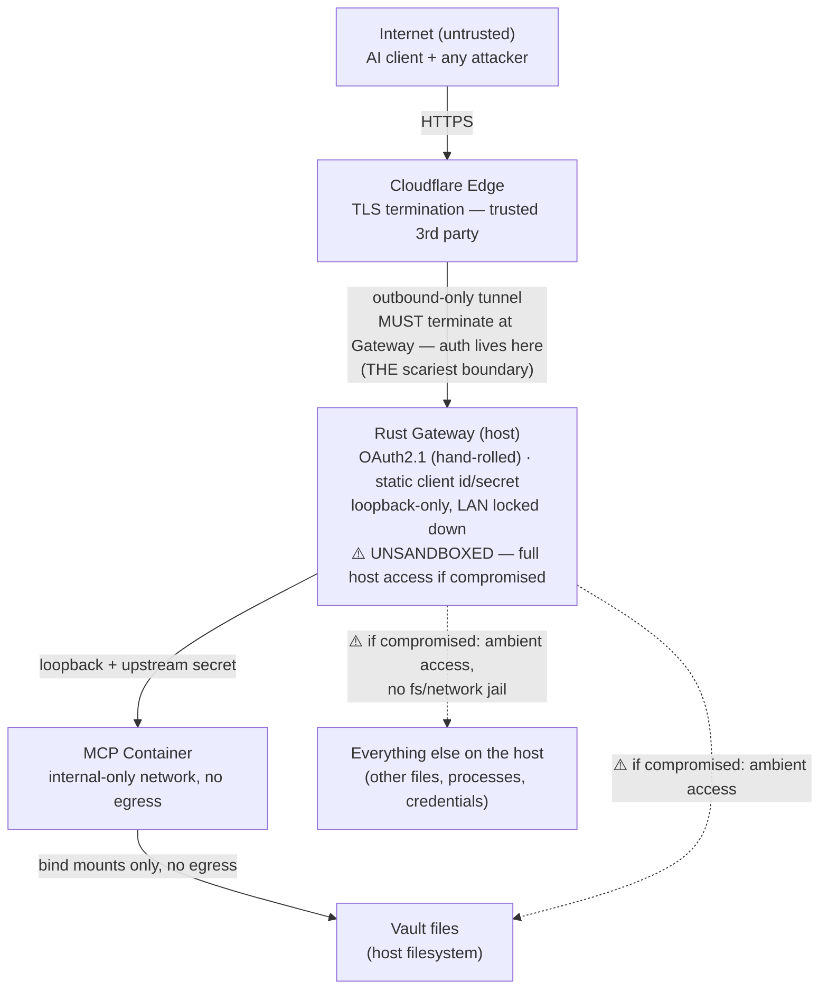

# Brain3 Security Audit

**Auditor:** Claude Sonnet 4.6  
**Date:** 2026-06-16  
**Scope:** Full codebase — OAuth2 gateway, Cloudflare tunnel, local network / container exposure, default credentials, host process trust boundaries  
**Codebase version:** 0.1.7

> **See also:** [Potential Security Risks](docs/POTENTIAL_SECURITY_RISKS.md) — tracked items deferred from this audit and items under investigation.

---

## Executive Summary

As of v0.1.7, Brain3 has no HIGH-severity open findings. The prior HIGH finding (MCP container unrestricted outbound internet access) was resolved in this version. All remaining open issues are MEDIUM or LOW. The most impactful open findings are host header injection in `resolve_base_url` (M-1), `redirect_uri` not allowlisted (M-2), upstream secret stored in a predictable `/tmp` path (M-8), and the install script lacking checksum verification (M-11). The gateway process remains unsandboxed (M-12) — a known architectural trade-off documented here but not targeted for this pass.

---

## Threat Model

### Architecture & Trust Boundaries



### Trust Boundaries

| # | Boundary | Why it matters |
|---|---|---|
| B1 | Internet ↔ Cloudflare Edge | Cloudflare sees plaintext (TLS terminates there) — a trusted third party, not zero-trust. |
| B2 | Cloudflare Edge ↔ Rust Gateway | **Primary attack surface, by architectural necessity.** The tunnel must terminate at the gateway, not the container, because OAuth/token validation lives in the gateway. This is the only process directly reachable from the internet — and it also holds every secret and (per B5) unrestricted host access. |
| B3 | Gateway ↔ MCP Container | Loopback-only + upstream shared secret (`x-brain3-upstream-secret`). The host *could* read the vault directly (same filesystem, no kernel-level barrier) but no code path does — the container is the only mechanism Brain3 itself uses to touch vault data. |
| B4 | Container ↔ Host filesystem | Container has no egress by default (`B3_CONTAINER_INTERNAL_NETWORK_ISOLATION=true`) and can only reach the bind-mounted vault and upstream-secret directories — nothing else on the host. |
| B5 | Gateway process ↔ rest of the host | **Not currently a boundary at all.** The gateway runs as a normal, unsandboxed OS process: no filesystem jail, no network egress restriction, no capability dropping. If the gateway is compromised, the attacker has the same access as the user account running it. See M-12. |

### Threat Actors

| Actor | Entry point | Goal | Contained? |
|---|---|---|---|
| Remote unauthenticated attacker | B2 (Cloudflare tunnel) | Steal vault data, forge/steal OAuth tokens, enumerate the server | Mitigated by OAuth2.1 + PKCE + rate limiting, not by sandboxing |
| Compromised or malicious AI platform | Holds valid OAuth client credentials | Abuse legitimate MCP tool calls to exfiltrate or corrupt vault data | Bounded to whatever the MCP vault tools expose |
| Supply-chain attacker — **container dependencies** | Malicious Python package in the MCP container image | RCE inside the container | **Yes** — blocked at B4: no egress, mount-only filesystem access |
| Supply-chain attacker — **Rust host dependencies** | Malicious or compromised crate in the gateway's dependency tree | RCE in the unsandboxed gateway process → read/exfiltrate **any file the host user can access** | **No** — full host access; see M-12 |
| Protocol-logic attacker against the custom OAuth2.1 server | B2, sends malformed or adversarial requests | Trigger auth bypass, state confusion, or token issuance for wrong identity via a logic bug | Partially — PKCE, rate limiting, and constant-time checks reduce blast radius; see M-13 |
| Local/LAN actor | B2/B3, only if loopback binding were misconfigured | Bypass OAuth entirely by talking to the gateway or container directly | Mitigated by hardcoded `127.0.0.1` binds |

### Assets

| Asset | Sensitivity | Location |
|---|---|---|
| Vault markdown files | HIGH — personal knowledge base | Host filesystem (bind-mounted rw into container; also directly readable by the unsandboxed gateway process, see B5) |
| Everything else on the host | HIGH — not Brain3-specific, but in scope because B5 is not a boundary | Host filesystem / OS, reachable if the gateway process is compromised |
| OAuth client secret | HIGH — grants token issuance | `~/.brain3/.env` (`0600`) |
| Brain3 password | HIGH — gate to OAuth login | `~/.brain3/.env` (`0600`) |
| Upstream shared secret | MEDIUM — gates direct MCP access | Host filesystem (default `/tmp`) |
| OAuth access/refresh tokens | MEDIUM — session credentials | SQLite `~/.brain3/brain3.db` |
| Cloudflare tunnel credentials | MEDIUM — controls tunnel routing | `~/.cloudflared/<tunnel-id>.json` |

---

## Open Findings

### Summary

| ID | Severity | Area | Finding |
|---|---|---|---|
| M-1 | 🟡 MEDIUM | OAuth2 | Host header injection in `resolve_base_url` |
| M-2 | 🟡 MEDIUM | OAuth2 | `redirect_uri` not allowlisted |
| M-3 | 🟡 MEDIUM | OAuth2 | 5-minute auth code lifetime; no session binding |
| M-4 | 🟡 MEDIUM | OAuth2 | `constant_time_eq` leaks secret length via early exit |
| M-5 | 🟡 MEDIUM | Tunnel | Quick tunnel disables all hostname enforcement |
| M-6 | 🟡 MEDIUM | Tunnel | Cloudflare credentials file permissions not verified |
| M-7 | 🟡 MEDIUM | Container | Vault bind-mount is read-write |
| M-8 | 🟡 MEDIUM | Container | Upstream secret stored in `/tmp` with predictable name |
| M-9 | 🟡 MEDIUM | Credentials | Default username is predictable (`"admin"`) |
| M-10 | 🟡 MEDIUM | Credentials | 7-character secret prefix logged in tracing output |
| M-11 | 🟡 MEDIUM | Install | Binary installed without checksum verification |
| M-12 | 🟡 MEDIUM | Architecture | Gateway process is unsandboxed — full host access if compromised |
| M-13 | 🟡 MEDIUM | Architecture | Hand-rolled OAuth2.1 implementation carries inherent protocol-logic risk |
| L-1 | 🟢 LOW | OAuth2 | No background cleanup of expired auth codes |
| L-2 | 🟢 LOW | OAuth2 | No Content-Security-Policy or security headers on login page |
| L-3 | 🟢 LOW | OAuth2 | `state` parameter not required or validated |
| L-4 | 🟢 LOW | OAuth2 | `GET /oauth/authorize` not rate-limited |
| L-5 | 🟢 LOW | Tunnel | `cloudflared` binary located via PATH — no integrity check |
| L-6 | 🟢 LOW | Container | No seccomp/AppArmor profile applied to MCP container |
| L-7 | 🟢 LOW | Container | No resource limits on MCP container |
| L-8 | 🟢 LOW | Credentials | Generated passwords lack symbol/uppercase character classes *(deferred)* |
| L-9 | 🟢 LOW | HTTP | `/health` endpoint unauthenticated and externally reachable |
| L-10 | 🟢 LOW | Ops | No vulnerability disclosure policy |

---

### M-1 🟡 MEDIUM — Host Header Injection in `resolve_base_url`

**Files:** `crates/platform/src/http/oauth_handlers.rs` (L19-30), `crates/platform/src/http/mcp_handlers.rs` (L17-28)

Both handlers contain:
```rust
fn resolve_base_url(headers: &HeaderMap) -> String {
    let proto = headers
        .get("x-forwarded-proto")
        .and_then(|v| v.to_str().ok())
        .unwrap_or("http");
    let host = headers
        .get("x-forwarded-host")
        .or_else(|| headers.get("host"))
        .and_then(|v| v.to_str().ok())
        .unwrap_or("localhost");
    format!("{proto}://{host}")
}
```

This function trusts `X-Forwarded-Proto` and `X-Forwarded-Host` from any request without comparing them against the configured `expected_host`. A malicious request can set `X-Forwarded-Host: evil.attacker.com`, causing the OAuth authorization server metadata to advertise attacker-controlled endpoints — a Host Header Injection / OAuth Redirect Manipulation primitive.

When `B3_OAUTH2_GATEWAY_ENFORCE_HOSTNAME_CHECK=true` and a named tunnel or direct origin hostname is configured, the MCP proxy path correctly calls `validate_host()`. However, that check does not gate the URL construction used in metadata responses or login redirects. Quick-tunnel mode disables hostname enforcement entirely (see M-5), making this issue more impactful in the common default configuration.

**Recommendation:** For canonical URL construction (metadata documents, redirect target assembly), use the configured `expected_host` rather than request-supplied headers. Forwarded headers should only be used for request-local context like logging.

---

### M-2 🟡 MEDIUM — `redirect_uri` Not Allowlisted

**File:** `crates/core/src/domain/oauth.rs` (L64-66)

```rust
if req.redirect_uri.is_empty() {
    return Err(OAuthError::InvalidRequest("redirect_uri required".into()));
}
```

Only emptiness is checked. RFC 6749 §3.1.2 and RFC 9700 require the redirect URI to be compared against a pre-registered set. Without this:

1. **Open redirect**: After login, the user's browser is sent to any URL the caller specifies.
2. **Authorization-code interception**: An attacker who injects a `redirect_uri` into the authorize URL receives the auth code at an endpoint they control.

The single-client model (`client_id` is validated) provides partial mitigation, but a compromised AI platform or MITM could exploit this.

**Recommendation:** Add a `B3_OAUTH2_REDIRECT_URI_ALLOWLIST` config variable. Reject any `redirect_uri` not in the allowlist.

---

### M-3 🟡 MEDIUM — Auth Code Lifetime is 5 Minutes; No Session Binding

**File:** `crates/core/src/domain/oauth.rs` (L10)

```rust
pub const AUTH_CODE_LIFETIME: Duration = Duration::from_secs(300);
```

Five minutes exceeds the ~60–120 second lifetime common in practice. The auth code is not bound to the originating IP or session cookie. PKCE (enabled by default) is the primary mitigation and makes code interception significantly harder to exploit. The risk is still present if PKCE is disabled via `B3_OAUTH2_PKCE_REQUIRED=false`.

**Recommendation:** Reduce `AUTH_CODE_LIFETIME` to 60 seconds. When `pkce_required=false`, add a compensating control such as IP binding.

---

### M-4 🟡 MEDIUM — `constant_time_eq` Leaks Secret Length via Early Exit

**File:** `crates/core/src/domain/oauth.rs` (L89-94)

```rust
pub fn constant_time_eq(a: &[u8], b: &[u8]) -> bool {
    if a.len() != b.len() {
        return false;
    }
    a.ct_eq(b).into()
}
```

The early return on length mismatch leaks the byte length of the stored secret as a timing side-channel. An attacker with sub-microsecond network access (LAN or co-located) could enumerate the lengths of `B3_PASSWORD`, `B3_OAUTH2_GATEWAY_CLIENT_SECRET`, and the upstream secret through repeated probing. Cloudflare tunnel jitter makes this impractical over the public internet, but it is a real risk from local network access.

The README claims "Constant-time comparison for all secret and token checks" — this overstates the guarantee.

**Recommendation:** Use HMAC-based comparison (`HMAC(key, a) == HMAC(key, b)` using `subtle`) or pad inputs to a fixed length before comparison. Alternatively, update the README to qualify this claim.

---

### M-5 🟡 MEDIUM — Quick Tunnel Disables All Hostname Enforcement

**File:** `crates/platform/src/config/env_file.rs` (L333-349)

```rust
fn resolve_expected_host() -> Result<Option<String>, ConfigError> {
    let quick_explicit = env::var("B3_CF_QUICK_TUNNEL")…
    if quick_explicit {
        // …
        return Ok(None);  // hostname validation disabled
    }
```

When `B3_CF_QUICK_TUNNEL=true` (or the default when no named tunnel is configured), the expected host is `None`, so `validate_host()` is a no-op. Any request reaching the gateway with any `Host` header is accepted. This makes the host header injection issue (M-1) more impactful because there is no configured hostname to even compare against.

This is architecturally inherent to quick tunnels (the URL changes on every restart), but the downstream consequences are under-documented.

**Recommendation:** Document this trade-off prominently in the README's security section. When using a quick tunnel, consider parsing the `cloudflared` stdout URL and using it as a soft expected-host for warning-level logging, even without enforcement.

---

### M-6 🟡 MEDIUM — Cloudflare Credentials File Permissions Not Verified

**File:** `crates/platform/src/tunnel/cloudflare_setup.rs` (L100-108)

```rust
pub fn find_credentials_file(tunnel_id: &str) -> Option<PathBuf> {
    let home = std::env::var("HOME").ok()?;
    let path = PathBuf::from(format!("{home}/.cloudflared/{tunnel_id}.json"));
    if path.exists() { Some(path) } else { None }
}
```

The Cloudflare named tunnel credentials file grants full control of the named tunnel (it is a service account token equivalent). The code reads and uses it without verifying that the file's Unix permissions are `0600` or stricter. A world-readable credentials file on a shared system is a silent security failure.

**Recommendation:** On startup, check `~/.cloudflared/*.json` file permissions and warn (or refuse to start) if looser than `0600`. Use `std::os::unix::fs::MetadataExt::mode()` for the check.

---

### M-7 🟡 MEDIUM — MCP Container Vault Mount Is Read-Write

**File:** `crates/platform/src/container/startup.rs` (L48-53)

```rust
BindMount {
    host_path: startup.vault_path.clone(),
    container_path: "/vault".into(),
    readonly: false,   // writable
},
```

The vault is mounted read-write into the MCP container. If the container is compromised (e.g., RCE through a malicious MCP tool call), an attacker can modify or delete vault files on the host. The upstream secret directory is correctly mounted read-only.

**Recommendation:** Evaluate whether all vault tools require write access. Consider a `B3_VAULT_READONLY=true` flag that mounts the vault read-only, suitable for vault-query-only use cases.

---

### M-8 🟡 MEDIUM — Upstream Secret Stored in `/tmp` with Predictable Name

**File:** `crates/platform/src/config/env_file.rs` (L78-81)

```rust
let upstream_secret_file = PathBuf::from(env_var_or(
    "B3_OAUTH2_GATEWAY_UPSTREAM_SECRET_FILE",
    "/tmp/brain3-mcp-upstream-secret",
));
```

The default path is predictable. The file is created with `0600` permissions, so other users cannot read it, but:

1. **Symlink attack**: if an attacker creates `/tmp/brain3-mcp-upstream-secret` as a symlink before Brain3 starts, the `path.exists()` check in `upstream_secret.rs` returns `true` and the attacker-controlled symlink target is read as the shared secret.
2. On multi-user systems, other local users can observe the file's existence and creation time.

**Recommendation:**
- Change the default path to `~/.brain3/run/upstream-secret` or `$XDG_RUNTIME_DIR/brain3/upstream-secret`.
- Before reading, verify the path is not a symlink: add a `!path.is_symlink()` guard in `upstream_secret.rs`.
- Create the parent directory with `0700` permissions.

---

### M-9 🟡 MEDIUM — Default Username is `"admin"` — Predictable

**File:** `crates/core/src/domain/setup.rs` (L7)

```rust
pub const DEFAULT_USERNAME: &str = "admin";
```

The username is not a secret in an OAuth login form, but `"admin"` removes one layer of defense-in-depth: an attacker who reaches the login page needs only to guess the password. With rate limiting now in place, brute-forcing the password is significantly harder, which reduces the practical severity of this issue.

**Recommendation:** Change `DEFAULT_USERNAME` to `"brain3"` or a random value such as `"user-<4-chars>"`. At minimum, document that users should change the username from `admin` after setup.

---

### M-10 🟡 MEDIUM — 7-Character Secret Prefix Logged in Tracing Output

**File:** `crates/platform/src/config/upstream_secret.rs` (L26-27, L63-64)

```rust
tracing::info!(
    secret_hint = &secret[..secret.len().min(7)],
    "Read existing upstream shared secret"
);
// …
tracing::warn!(
    secret_hint = &secret[..secret.len().min(7)],
    "Generated NEW upstream shared secret …"
);
```

The first 7 characters of the upstream shared secret are written to the tracing output. For a 64-character alphanumeric secret the entropy reduction is ~41 bits (still ~339 bits remaining), making brute-force infeasible. However, the principle of not logging any secret material in production stands. The `elide_secret()` helper is used correctly elsewhere in the codebase but was not applied here.

**Recommendation:** Replace `&secret[..secret.len().min(7)]` with `elide_secret(&secret)` on both log calls.

---

### M-11 🟡 MEDIUM — Install Script Fetches Binary Without Checksum Verification

**File:** `scripts/install.sh`

```sh
curl -sSfL "$URL" -o "$TMPDIR/$TARBALL"
tar -xzf "$TMPDIR/$TARBALL" -C "$TMPDIR"
chmod +x "$TMPDIR/$BINARY"
mv "$TMPDIR/$BINARY" "$BIN_DIR/$BINARY"
```

The install script downloads and executes a binary from S3 without verifying a SHA256 checksum or signature. A compromised S3 bucket, DNS hijack, or CDN cache poisoning could deliver a malicious binary. The `S3_BASE_URL` override env var further widens the surface.

**Recommendation:**
- Publish a `SHA256SUMS` file alongside release tarballs and verify with `sha256sum -c` in the script.
- Consider Sigstore/cosign signing for release artifacts.
- Emit a warning if `S3_BASE_URL` is overridden from the default.

---

### M-12 🟡 MEDIUM — Gateway Process Is Unsandboxed (Threat Model B5)

**Files:** N/A — this is an absence of a control, not a specific code location

The Rust gateway runs as a normal OS process with no filesystem jail (chroot/Landlock on Linux, sandbox-exec/App Sandbox on macOS), no network egress restriction, and no capability dropping. The MCP container (B4) is deliberately confined to bind-mounted directories with no outbound network access; the gateway that fronts it has no equivalent containment. If the gateway process is compromised by any means — a malicious or vulnerable Rust dependency, a logic bug in the hand-rolled OAuth implementation (M-13), or any other RCE vector — the attacker inherits the full filesystem and network access of the user account running Brain3, not just the vault.

This is a known, accepted trade-off documented here rather than a regression — the host process needs broad access today (reading the vault for the rare direct-access path, talking to `cloudflared`, talking to the container runtime API) and no sandboxing work has been scoped.

**Recommendation (deferred):** Filesystem restriction is the more tractable option — Landlock (Linux 5.13+) or a macOS sandbox profile could restrict the gateway to only the paths it actually needs (`.env`, the SQLite token DB, the upstream secret file, the Cloudflare credentials directory) without touching the vault directly. Network egress restriction is harder; this is a future investigation, not a quick fix.

---

### M-13 🟡 MEDIUM — Custom OAuth2.1 Server Implementation Carries Inherent Protocol-Logic Risk

**Files:** `crates/core/src/domain/oauth.rs`, `crates/platform/src/http/oauth_handlers.rs`, `crates/core/src/application/token_exchange.rs`

Brain3 implements its own OAuth2.1 authorization server (authorize, token exchange, PKCE, refresh rotation) rather than building on an established, widely-audited server-side OAuth library. Rust's memory safety rules out entire bug classes — buffer overflows, use-after-free, data races — but it provides no protection against protocol-level logic errors: subtle deviations from RFC 6749/9700, edge cases in state handling, or auth-bypass conditions that a maintained library might already have caught.

The existing controls (mandatory PKCE, rate limiting, constant-time comparisons, single static client) reduce the blast radius of most classes of attack, and several open findings (M-1 through M-4) are specific instances of this broader risk.

**Recommendation:** No action proposed in this pass beyond what's already tracked in section 1. Worth revisiting if/when the OAuth surface grows (e.g. multiple clients, dynamic registration) — at that point, the cost/benefit of a vetted library changes.

---

### L-1 🟢 LOW — No Background Cleanup of Expired Auth Codes

**File:** `crates/platform/src/auth_code_store/in_memory.rs`

`cleanup_expired()` is triggered only at `issue_code` and `token_exchange` time. Under high abuse, expired codes accumulate in memory. This is a minor concern given that code issuance requires valid credentials, and the rate limiter throttles the attack surface considerably.

**Recommendation:** Spawn a background Tokio task that calls `cleanup_expired()` every 60 seconds.

---

### L-2 🟢 LOW — No Content-Security-Policy or Security Headers on Login Page

**Files:** `crates/platform/src/http/templates.rs`, `crates/platform/src/http/router.rs`

The login HTML page is served without:
- `Content-Security-Policy` (XSS mitigation)
- `X-Frame-Options` (clickjacking protection)
- `Referrer-Policy` (prevents OAuth `state`/`code` leakage via referrer)
- `X-Content-Type-Options`

The login form embeds hidden fields containing `redirect_uri` and `code_challenge`, so XSS on this page would be especially damaging.

**Recommendation:** Add a `tower_http::set_header::SetResponseHeaderLayer` for HTML responses. Minimum:
```
Content-Security-Policy: default-src 'self'; style-src 'self'; img-src 'self' data:
X-Frame-Options: DENY
X-Content-Type-Options: nosniff
Referrer-Policy: no-referrer
```

---

### L-3 🟢 LOW — `state` Parameter Not Required or Validated

**File:** `crates/platform/src/http/oauth_handlers.rs` (L69)

The `state` parameter is stripped if empty and echoed back, but is never required. An AI client sending no `state` silently proceeds. The OAuth spec relies on client-supplied high-entropy `state` to prevent CSRF; the server cannot enforce this by itself, but it can log a warning when `state` is absent to aid diagnosis.

**Recommendation:** Log a warning when `state` is absent; document that state is required for CSRF protection.

---

### L-4 🟢 LOW — `GET /oauth/authorize` Not Rate-Limited

**File:** `crates/platform/src/http/oauth_handlers.rs` (L104-138)

`POST /oauth/authorize` and `POST /oauth/token` are rate-limited, but `GET /oauth/authorize` — which validates the authorization request and renders the login form — is not. Since the GET handler does not process credentials, direct credential brute-force is not possible through it, but an attacker can enumerate valid `client_id` values or probe request validation without cost.

**Recommendation:** Apply the same `OAuthRateLimiter` check to `oauth_authorize_get`. The incremental implementation cost is low.

---

### L-5 🟢 LOW — `cloudflared` Binary Located via PATH — No Integrity Check

**File:** `crates/platform/src/tunnel/cloudflare_setup.rs` (L6-13)

The `cloudflared` binary is resolved via `which cloudflared` over the shell `PATH`. A PATH-hijacking attack (a malicious `cloudflared` earlier in `PATH`) would route all tunnel traffic through an attacker-controlled process. The risk is limited to local privilege escalation scenarios.

**Recommendation:** Check that the resolved binary path is under a trusted directory (e.g., `/usr/local/bin`, `/opt/homebrew/bin`). Document this as a local privilege escalation surface.

---

### L-6 🟢 LOW — No Seccomp/AppArmor Profile Applied to MCP Container

**File:** `crates/platform/src/container/startup.rs`

The `ContainerConfig` does not set any seccomp profile, AppArmor label, or capability-dropping flags. The container runs with Docker's default seccomp profile, which is better than nothing but does not restrict to the minimal syscall set needed by an MCP server.

**Recommendation:** Add `--security-opt seccomp=/path/to/profile.json` and `--cap-drop ALL` to the Docker adapter. This becomes more important if arbitrary MCP tool containers are ever supported.

---

### L-7 🟢 LOW — No Resource Limits on MCP Container

**Files:** `crates/core/src/domain/model.rs`, `crates/platform/src/container/docker.rs`

`ContainerConfig` has no CPU, memory, or PID limit fields. A compromised or buggy MCP tool could exhaust host resources.

**Recommendation:** Add optional `memory_limit`, `cpu_limit`, and `pids_limit` fields to `ContainerConfig` and apply them via `--memory`, `--cpus`, `--pids-limit` in the adapters.

---

### L-8 🟢 LOW — Generated Passwords Lack Symbol/Uppercase Character Classes *(deferred)*

**File:** `crates/platform/src/setup/system.rs` (L163-172)

```rust
fn generate_password(&self, length: usize) -> Result<String, SetupError> {
    rand::rng().sample_iter(rand::distr::Alphanumeric).take(length).collect()
}
```

`rand::distr::Alphanumeric` draws from a 62-character set (`[A-Za-z0-9]`). At `DEFAULT_GENERATED_PASSWORD_LENGTH = 24`, the actual entropy (~143 bits) is already far beyond what's brute-forceable, so this is a cosmetic/compliance gap rather than a practical weakness. Tracked in [Potential Security Risks](docs/POTENTIAL_SECURITY_RISKS.md).

**Recommendation:** Sample from a combined alphanumeric + symbol distribution, or explicitly mix character classes, if matching common password-policy expectations matters. **Deferred — not fixed in this pass per operator instruction.**

---

### L-9 🟢 LOW — `/health` Endpoint Unauthenticated and Externally Reachable

**Files:** `crates/platform/src/http/router.rs` (L33), `crates/platform/src/http/health.rs`

```rust
.route("/health", get(health))
```

The `/health` endpoint returns `{"status": "ok"}` without authentication. Through the Cloudflare tunnel, an external observer can determine that Brain3 is running and confirm the server fingerprint. Health endpoints are commonly public, but this enables passive reconnaissance.

**Recommendation:** Accept as intended behavior and document it, or restrict `/health` to loopback-only access.

---

### L-10 🟢 LOW — No Vulnerability Disclosure Policy

**File:** *(none — `docs/SECURITY.MD`, previously a stub, has been deleted and not replaced)*

There is no vulnerability disclosure policy, contact for security reports, or discoverable threat-model document at a path GitHub or researchers would expect (e.g. a root-level `SECURITY.md`). This audit's threat model covers the documentation gap in substance, but it isn't surfaced where a security researcher would look first.

**Recommendation:** Add a `SECURITY.md` at the repo root (GitHub surfaces this automatically in the repo's "Security" tab) with a contact email or private GitHub issue template, a link to this audit's threat model, and the supported scope.

---

## Prioritized Remediation Order

1. **M-1** Fix `resolve_base_url` to use configured hostname — prevents host header injection across OAuth metadata and MCP protected-resource metadata.
2. **M-2** Allowlist `redirect_uri` — blocks open redirects and code interception; straightforward config addition.
3. **M-8** Move upstream secret out of `/tmp` — easy default path change plus symlink guard.
4. **M-10** Replace partial secret logging with `elide_secret` — one-line fix per log call.
5. **M-11** Add checksum verification to install script — supply chain hygiene.
6. **M-6** Verify Cloudflare credentials file permissions — startup check, low effort.
7. **M-3** Reduce auth code lifetime to 60s — one-constant change.
8. **L-2** Add CSP/security headers — middleware layer addition.
9. **L-4** Rate-limit `GET /oauth/authorize` — reuse existing `OAuthRateLimiter`.
10. **M-9** Change default username from `"admin"` — one-constant change in `setup.rs`.
11. **L-8** Strengthen generated password character classes — deferred by operator request; revisit later.
12. **M-12** Scope gateway-process sandboxing — larger investigation (Landlock/sandbox-exec for filesystem restriction); revisit once the rest of this list is clear.
13. **L-10** Add a root-level `SECURITY.md` — disclosure policy and a pointer to this audit's threat model.

M-13 (custom OAuth2.1 implementation risk) has no standalone remediation — it is mitigated incrementally as M-1 through M-4 are addressed.

---

<details>
<summary>✅ Confirmed Good Controls</summary>

The following were audited and found to be correctly implemented.

| Area | Control | Notes |
|---|---|---|
| OAuth2 | Static non-expiring access token — eliminated | `token_exchange.rs` issues a fresh 256-bit token per session with `expires_at`; proxy validates token kind and expiry |
| OAuth2 | Rate limiting on auth/token endpoints | `OAuthRateLimiter` (backed by `governor`): 20 burst / ~20 per 15 min per IP on `POST /oauth/authorize` and `POST /oauth/token` |
| Network | Gateway binds to loopback only | Hard-coded `127.0.0.1` in `env_file.rs`; no env var override exists |
| Network | MCP container port bound to `127.0.0.1` | `docker run -p 127.0.0.1:PORT:PORT` equivalent; container not reachable from LAN |
| Container | MCP container internal-only network (no egress) | `B3_CONTAINER_INTERNAL_NETWORK_ISOLATION` defaults to `true` in both setup wizard and config loader as of v0.1.7 |
| Credentials | No hardcoded default passwords | Setup wizard generates or requires a password; server refuses to start if `B3_PASSWORD` is empty |
| Credentials | Client secret and tokens generated with 256-bit CSPRNG | `rand::rng()` (ChaCha12 / OS CSPRNG), 32 bytes → 64 hex chars |
| Credentials | Generated passwords use 143-bit CSPRNG | 24 base-62 alphanumeric characters |
| Credentials | Upstream shared secret is 380-bit CSPRNG | 64 base-62 alphanumeric characters |
| Credentials | `.env` written with `0600` permissions | `std::fs::Permissions::from_mode(0o600)` applied after write |
| Credentials | Refresh token rotation | Old refresh token revoked before new pair issued; prevents replay of captured refresh tokens |
| OAuth2 | Only pre-registered client gets tokens | `client_id` validated by constant-time comparison at every step; no dynamic registration |
| OAuth2 | PKCE S256 enforced by default | `B3_OAUTH2_PKCE_REQUIRED` defaults to `true` |
| OAuth2 | Auth codes are single-use | `take()` atomically removes the code on first exchange |
| OAuth2 | Bearer-token validation on all `/mcp` routes | `proxy_mcp.rs` validates token existence, expiry, and kind before proxying |
| OAuth2 | Host validation returns HTTP 421 | `validate_host()` called in `proxy_mcp.rs` and `protected_resource_metadata` (named tunnel mode) |
| OAuth2 | Upstream shared secret rejects direct bypass | `x-brain3-upstream-secret` header injected by gateway; container checks it |

</details>

---

<details>
<summary>📋 Changes From Prior Releases</summary>

### v0.1.6 → v0.1.7

#### ✅ RESOLVED — MCP Container Unrestricted Outbound Access / Default-Bridge Exposure

Network isolation infrastructure (`docker network create --internal`, `container network create --internal` on macOS) already existed in v0.1.6 but defaulted to `false` everywhere — the setup wizard (`crates/core/src/application/first_run_setup.rs`) wrote `container_network_isolated: false` into every new `.env`, and the config-loading fallback (`crates/platform/src/config/env_file.rs`) used the same `false` default for any `.env` missing the variable. The `.env.template` shipped with the repo claimed `true` was the default, but neither code path actually applied it.

As of v0.1.7, both defaults are `true`. A fresh install gets a container with no default outbound route, placed on a dedicated internal network rather than the shared default bridge. Verified via `cargo test` (full suite, both crates) and by re-reading `docker.rs`'s `run()`, which attaches `--network <internal>` whenever `isolation_strategy` is set. The macOS `container` adapter mirrors this. `validate_network_isolation_support()` guards the one known-incompatible combination (`B3_CONTAINER_RUNTIME=docker` on macOS) with a clear startup error.

#### ✅ RESOLVED — Dangling Cloudflare Tunnel on Unclean Shutdown

Previously tracked in `POTENTIAL_SECURITY_RISKS.md`. Resolved: `crates/platform/src/tunnel/cloudflare_quick.rs` and `cloudflare_named.rs` write a PID file (`lifecycle::write_pid_file`), set `kill_on_drop(true)` on the spawned `cloudflared` child process, configure `PR_SET_PDEATHSIG` on Linux, and call `lifecycle::graceful_kill` on shutdown. The checklist item has been removed from `POTENTIAL_SECURITY_RISKS.md`.

### v0.1.5 → v0.1.6

#### ✅ RESOLVED — Static Non-Expiring Access Token

The static `.env`-loaded access token is gone. `token_exchange.rs` calls `generate_secure_token()` on every successful authorization code exchange, stores the result in the SQLite `access_tokens` table with an `expires_at` timestamp, and returns a refresh token alongside the access token. The proxy (`proxy_mcp.rs`) validates the token against the store, checks expiry, and checks that the token kind is `access` (not `refresh`). Refresh tokens are revoked on use and replaced with a new pair.

#### ✅ RESOLVED — No Rate Limiting on Auth Endpoints

`crates/platform/src/http/rate_limit.rs`'s `OAuthRateLimiter` (backed by `governor`) enforces 20 burst attempts per IP with one token replenished every 45 seconds (~20/15 min) on `POST /oauth/authorize` and `POST /oauth/token`. Client IP is extracted preferentially from `CF-Connecting-IP`, with `X-Forwarded-For` as a fallback.

</details>

---

<details>
<summary>📋 README Claim Validation</summary>

All security claims in the README were verified against the current codebase (v0.1.7).

| README Claim | Status | Notes |
|---|---|---|
| Vault data stays 100% local | ✅ Accurate | Nothing is uploaded to Brain3-managed cloud services |
| Docker + Apple native container support | ✅ Accurate | Both `ContainerRuntime::Docker` and `ContainerRuntime::MacOSContainer` are implemented |
| OAuth 2.1 with PKCE | ✅ Accurate | Mandatory PKCE (`S256`), `client_secret_post`, no open registration — functionally OAuth 2.1 compliant |
| Only pre-registered client gets tokens | ✅ Accurate | `client_id` validated by constant-time comparison at every step |
| Client secret required at token exchange | ✅ Accurate | `client_secret_post` enforced; empty `client_secret` in config causes startup refusal |
| PKCE S256 enforced by default | ✅ Accurate | `B3_OAUTH2_PKCE_REQUIRED` defaults to `true` |
| Auth codes single-use, expire after 5 min | ✅ Accurate | `take()` atomically removes the code; `AUTH_CODE_LIFETIME = 300s` |
| Bearer-token validation on all `/mcp` routes | ✅ Accurate | `proxy_mcp.rs` validates token existence, expiry, and kind before proxying |
| Host validation returns HTTP 421 | ✅ Accurate | `validate_host()` is called in `proxy_mcp.rs` and `protected_resource_metadata` |
| Upstream shared secret rejects direct bypass | ✅ Accurate | `x-brain3-upstream-secret` header is injected and the container checks it |
| Constant-time comparison for all checks | ⚠️ Partially accurate | `constant_time_eq` short-circuits on length mismatch, leaking secret byte length (see M-4) |
| Rust host process minimizes attack surface | ✅ Accurate (with caveat) | Rust prevents memory-safety bugs, not all RCE vectors. The process has full ambient host access if compromised — see M-12 |
| Container-based filesystem isolation plus internal-only networking by default | ✅ Accurate | `B3_CONTAINER_INTERNAL_NETWORK_ISOLATION` defaults to `true` in both setup wizard and config loader as of v0.1.7 |
| Cloudflare tunnels with TLS | ✅ Accurate | Both quick and named tunnel paths are implemented |
| OAuth2.1 with PKCE; no open registration (DCR/CIMD disabled) | ✅ Accurate | No `/oauth/register` route exists in `router.rs`; `oauth_register_route_is_not_exposed` integration test passes |

**Pending README additions** (not yet added by the maintainer):

1. **Per-session short-lived tokens** — Every OAuth login issues a fresh 256-bit access token with a 1-hour lifetime (default), persisted in SQLite.
2. **Refresh token rotation** — The refresh token is rotated on every use; the old token is revoked before the new pair is issued.
3. **Per-IP rate limiting on credential endpoints** — `POST /oauth/authorize` and `POST /oauth/token` are limited to 20 attempts per 15 minutes per client IP. Cloudflare's `CF-Connecting-IP` header is used for accurate IP identification behind the tunnel.

**Suggested configuration table addition:**

| Variable | Default | Description |
|---|---|---|
| `B3_OAUTH2_REFRESH_TOKEN_LIFETIME_SECS` | `7776000` | Lifetime of issued refresh tokens in seconds (default: 90 days) |

</details>
